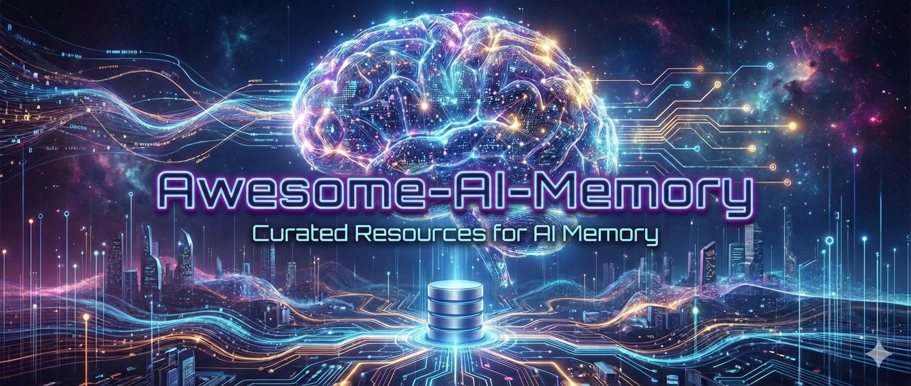

# Awesome-AI-Memory

<p align="center">
    【English | <a href="README_cn.md">中文</a></a>】
</p>

<div align="center">
    
</div>

[](https://github.com/IAAR-Shanghai/Awesome-AI-Memory) 
[](https://opensource.org/licenses/MIT)

[](https://github.com/IAAR-Shanghai/Awesome-AI-Memory/papers)
[](https://github.com/IAAR-Shanghai/Awesome-AI-Memory/projects)


## 👋 Introduction
Large Language Models (LLMs) have rapidly evolved into powerful general-purpose reasoning and generation engines. Nevertheless, despite their continuously advancing capabilities, LLMs remain fundamentally constrained by a critical limitation: the finite length of their context window. This constraint defines the scope of information directly accessible during a single inference process, endowing models with only short-term memory capabilities. Consequently, they struggle to support extended conversations, personalized interactions, continuous learning, and complex multi-stage tasks.

To transcend the inherent limitations of context windows, AI memory and memory systems for LLMs have emerged as a vital and active research and engineering frontier. By introducing external, persistent, and controllable memory structures beyond model parameters, these systems enable large models to store, retrieve, compress, and manage historical information during generation processes. This capability allows models to continuously leverage long-term experiences within limited context windows, achieving cross-session consistency and continuous reasoning abilities.

Awesome-AI-Memory is a comprehensive repository dedicated to AI memory and memory systems for large language models, systematically curating relevant research papers, framework tools, and practical implementations. This repository endeavors to map the rapidly evolving research landscape in LLM memory systems, bridging multiple disciplines including natural language processing, information retrieval, intelligent agent systems, and cognitive science.


---

## 🎯 Goal of Repository
Our mission is to establish a centralized, continuously evolving knowledge base that serves as a valuable reference for researchers and practitioners, ultimately accelerating the development of intelligent systems capable of long-term memory retention, sustained reasoning, and adaptive evolution over time.

---

## 📏 Project Scope
This repository focuses on memory mechanisms and system designs that extend or augment the context window capabilities of large language models, rather than merely addressing model pre-training or general knowledge learning. The content encompasses both theoretical research and engineering practices.

🌀 Included Content (In Scope)
- Memory and memory system designs for large language models
- External explicit memory beyond model parameters
- Short-term memory, long-term memory, episodic memory, and semantic memory
- Retrieval-Augmented Generation (RAG) as a memory access mechanism
- Memory management strategies (writing, updating, forgetting, compression)
- Memory systems in intelligent agents (Agents)
- Shared and collaborative memory in multi-agent systems
- Memory models inspired by cognitive science and biological memory
- Evaluation methods, benchmarks, and datasets related to LLM memory
- Open-source frameworks and tools for memory-enhanced LLMs

🌀 Excluded Content (Out of Scope)
- General model pre-training or scaling research without direct memory relevance
- Purely parameterized knowledge learning without memory interaction
- Traditional databases or information retrieval systems unrelated to LLMs
- Generic memory systems outside the LLM context (unless demonstrating direct transfer value)

---

<!-- ## 🗂️ AI-Memory Taxonomy

To systematically organize the diverse research and practical resources in the field of AI large model memory, this repository categorizes memory systems across multiple orthogonal dimensions, reflecting variations in storage methods, temporal scales, content forms, operational processes, and system architectures.
1. Memory by Storage Location
- Parametric Memory
  - Knowledge implicitly encoded within model weights
  - Static and not directly editable during inference
- External / Explicit Memory
  - Memory stored outside model parameters
  - Readable, writable, and dynamically updatable
2. Memory by Temporal Scope
- Short-Term Memory
  - Entirely dependent on context window
  - Session-level, temporary information
- Long-Term Memory
  - Persistent memory across sessions and time scales
  - Supports long-term consistency and personalization
3. Memory by Content Type
- Episodic Memory
  - Event-based historical interaction memory
  - Preserves temporal sequence and contextual relationships
- Semantic Memory
  - Facts, rules, and preferences abstracted from multiple experiences
  - Typically derived from compression or induction of episodic memory
- Procedural Memory
  - Memory related to action patterns, skills, and task execution strategies
4. Memory Operations
- Writing: Determining which information should be stored
- Retrieval: Selecting relevant memories for current tasks
- Updating: Correcting or merging existing memories
- Forgetting: Removing or weakening low-value information
- Compression: Summarizing historical information to fit context windows
5. Memory Mechanisms & Architectures
- Retrieval-Augmented Generation (RAG)
- Summary-based memory mechanisms
- Vectorized semantic retrieval
- Symbolic-neural hybrid memory systems
- Event-driven and trigger-based memory mechanisms
- Reinforcement learning-based memory strategy optimization
6. Memory in Agent Systems
- Single-agent memory
- Multi-agent shared memory
- Tool-augmented memory
- Planning-aware memory
- Personality and emotion-related memory
7. Evaluation & Benchmarks
- Long-term consistency evaluation
- Continuous interaction and long-term task benchmarks
- Memory recall and utilization efficiency metrics
- Personalization and user preference retention evaluation

--- -->

## 🔔 Recent hot research and news

+ 2025-12-24 – 🎉 Release Repository V(1.0)
+ 2025-12-10 – 🎉 Initial Repo

---

🗺️ Table of Contents
- [Introduction](#-introduction)
- [Goal of Repository](#-goal-of-repository)
- [Project Scope](#-project-scope)
- [Recent hot research and news](#-Recent-hot-research-and-news)
- [Core Concepts](#-core-concepts)
- [Paper List](#-paper-list)
  - [Survey](#Survey)
  - [Framework & Methods](#Framework-Methods)
  - [Benchmark & Datasets](#Benchmark-Datasets)
  - [System & model](#System-model)
- [Resource](#-resource)
  - [Benchmarks and tasks](#Benchmarks-and-tasks)
  - [Systems and open sources](#Systems-and-open-sources)
  - [Multi-media resource](#Multi-media-resource)
- [Make a Contribution](#-Make-a-Contribution)
- [Star Trends](#-star-trends)

---

## 🧠 Core Concepts

- LLM Memory: A fusion of implicit knowledge encoded within parameters (acquired during training) and explicit storage outside parameters (retrieved at runtime), enabling models to transcend token limitations and possess human-like abilities to "remember the past, understand the present, and predict the future."

- Memory System: The complete technical stack implementing memory functionality for large language models, comprising four core components:
  - Memory Storage Layer: Vector databases (e.g., Chroma, Weaviate), graph databases, or hybrid storage solutions
  - Memory Processing Layer: Embedding models, summarization generators, and memory segmenters
  - Memory Retrieval Layer: Multi-stage retrievers, reranking modules, and context injectors
  - Memory Control Layer: Memory prioritization managers, forgetting controllers, and consistency coordinators

- Memory Operations: Atomic memory operations executed through tool calling in memory systems:
  - Writing: Converting dialogue content into vectors for storage, often combined with summarization to reduce noise
  - Retrieval: Generating queries based on current context to obtain Top-K relevant memories
  - Updating: Finding relevant memories via vector similarity and replacing or enhancing them
  - Deletion: Removing specific memories based on user instructions or automatic policies (e.g., privacy expiration)
  - Compression: Merging multiple related memories into summaries to free storage space

- Memory Management: The methodology for managing memories within memory systems, including:
  - Memory Lifecycle: End-to-end management from creation, active usage, infrequent access, to archiving/deletion
  - Conflict Resolution: Arbitration mechanisms for contradictory information (e.g., timestamp priority, source credibility weighting)
  - Resource Budgeting: Allocating memory quotas to different users/tasks to prevent resource abuse
  - Security Governance: Automatic detection and de-identification of PII (Personally Identifiable Information)

- Memory Classification: A multi-dimensional classification system unique to memory systems:
  - By Access Frequency: Working memory (current tasks), frequent memory (personal preferences), archived memory (historical records)
  - By Structured Degree: Structured memory (database records), semi-structured memory (dialogue summaries), unstructured memory (raw conversations)
  - By Sharing Scope: Personal memory (single user), team memory (collaborative spaces), public memory (shared knowledge bases)
  - By Temporal Validity: Permanent memory (core facts), temporary memory (conversation context), time-sensitive memory (e.g., "user is in a bad mood today")

- Memory Mechanisms: Core technical components enabling memory system functionality:
  - Retrieval-Augmented Generation (RAG): Enhancing generation by retrieving relevant information from knowledge bases
  - Memory Reflection Loop: Models periodically "review" conversation history to generate high-level summaries
  - Memory Routing: Automatically selecting retrieval sources based on query type (personal memory/public knowledge base)

- Explicit Memory: Memory stored as raw text outside the model, implemented through vector databases with hybrid indexing strategies:
  - Dense Vector Indexing: Handling semantic similarity queries
  - Sparse Keyword Indexing: Processing exact match queries
  - Multi-vector Indexing: Segmenting long documents into multiple parts, each independently indexed

- Parametric Memory: Knowledge and capabilities stored within the fixed weights of a language model's architecture, characterized by:
  - Serving as the model's core long-term semantic memory carrier
  - Being activatable without external retrieval or explicit contextual support
  - Providing the foundational capability for zero-shot reasoning, general responses, and language generation

- Long-Term Memory: Key information designed for persistent storage, typically implemented as external knowledge bases with capabilities including:
  - Automatic Summarization: Distilling multi-turn dialogues into structured memory
  - Context Binding: Recording memory context to prevent erroneous generalization
  - Multimodal Storage: Simultaneously preserving text, images, audio, and other multimodal memories

- Short-Term Memory: Active information within the LLM's context window, constrained by attention mechanisms. Key techniques include:
  - KV Cache Management: Reusing key-value caches to reduce redundant computation
  - Context Compression: Using summaries instead of detailed history (e.g., "the previous 5 dialogue rounds discussed project budget")
  - Sliding Window Attention: Focusing only on the most recent N tokens while preserving special markers
  - Memory Summary Injection: Dynamically inserting summaries of long-term memory into short-term context

- Episodic Memory: Memory type recording specific user interaction history, fundamental to personalized AI:
  - User Identity Recognition: Identifying the same user across sessions
  - Interaction Trajectory Recording: Preserving user decision paths and feedback
  - Emotional State Tracking: Recording patterns of user mood changes
  - Preference Evolution Modeling: Capturing long-term changes in user interests

- Memory Forgetting: Deliberately designed forgetting mechanisms in large models, including:
  - Selective Forgetting (Machine Unlearning): Removing the influence of specific information from training data, such as covering specific knowledge with forgetting layers
  - Privacy-Driven Forgetting: Automatically identifying and deleting PII information, or setting automatic expiration
  - Memory Decay: Automatically lowering the priority of infrequently accessed memories based on usage frequency
  - Conflict-Driven Forgetting: Strategically updating or discarding old memories when new evidence conflicts with them

- Memory Retrieval: The complex process of precisely locating relevant information from massive memory repositories:
  - Semantic Pre-filtering: Vector similarity matching to obtain Top-100 candidates
  - Contextual Reranking: Reordering results based on current query context
  - Temporal Filtering: Prioritizing the most recent relevant information

- Memory Compression: A collection of techniques maximizing memory utility under limited resources:
  - Content-level Compression: Extracting core information while discarding redundant details
  - Representation-level Compression: Vector quantization (e.g., PQ coding), dimensionality reduction
  - Organization-level Compression: Clustering similar memories, building hierarchical memory structures
  - Knowledge Distillation: Transferring key patterns from external memory into parametric memory

---

## 📚 Paper List
Papers below are ordered by **publication date**:

<details>
  <summary><strong>Survey</strong></summary>

  <table style="width: 100%;">
    <tr>
      <td><strong>Date</strong></td>
      <td><strong>Paper & Summary</strong></td>
      <td><strong>Tags</strong></td>
      <td><strong>Links</strong></td>
    </tr>
    <tr>
      <td rowspan="2" style="width: 15%;">2025-12-15</td>
      <td style="width: 55%;">
      <strong>Memory in the Age of AI Agents: A Survey</strong></td>
      <td style="width: 15%;">
        
        
        
      </td>
      <td style="width: 15%;">
        <a href="https://arxiv.org/pdf/2512.13564">
        
        </a>
      </td>
    </tr>
    <tr>
        <td colspan="3">
          • Provides a comprehensive and up-to-date landscape of agent memory, explicitly distinguishing it from related concepts like LLM memory, RAG, and context engineering.<br>
          • Introduces a unified taxonomy examining memory through three lenses: <strong>Forms</strong> (token-level, parametric, latent), <strong>Functions</strong> (factual, experiential, working), and <strong>Dynamics</strong> (formation, evolution, retrieval).<br>
          • Discusses emerging research frontiers such as automation-oriented memory design, reinforcement learning integration, and trustworthiness, while compiling representative benchmarks and frameworks.
        </td>
    </tr>
    <tr>
      <td rowspan="2" style="width: 15%;">2025-09-18</td>
      <td style="width: 55%;">
      <strong>A Survey of Machine Unlearning</strong></td>
      <td style="width: 15%;"></td>
      <td style="width: 15%;">
        <a href="https://dl.acm.org/doi/full/10.1145/3749987">
        
        </a>
      </td>
    </tr>
    <tr>
        <td colspan="3">
          • Provides an in-depth exploration of the concept and background of machine unlearning, highlighting its importance in modern machine learning.<br>
          • Machine unlearning aims to enable learning algorithms to effectively remove the influence of specific data without requiring full model retraining.<br>
          • The paper analyzes the necessity, challenges, and design requirements of machine unlearning, reviews current research progress, and emphasizes the field’s complexity and diversity in terms of algorithmic effectiveness, fairness, and privacy protection.
        </td>
    </tr>
    <tr>
      <td rowspan="2" style="width: 15%;">2025-09-02</td>
      <td style="width: 55%;">
      <strong>A Survey on the Memory Mechanism of Large Language Model based Agents</strong></td>
      <td style="width: 15%;">
      
      <td style="width: 15%;">
        <a href="https://dl.acm.org/doi/pdf/10.1145/3748302">
        </a>
      </td>
    </tr>
    <tr>
        <td colspan="3">
          • Explores the memory mechanisms of LLM-based agents, emphasizing the crucial role of memory in agent self-evolution and complex interactions.<br>
          • Systematically summarizes and categorizes existing memory module designs and evaluation methods, while analyzing their roles and limitations across different application scenarios.<br>
          • Such agents are able to improve decision-making and task execution.
        </td>
    </tr>
    <tr>
      <td rowspan="2" style="width: 15%;">2025-05-31</td>
      <td style="width: 55%;">
      <strong>A Survey of Machine Unlearning in Large Language Models: Methods, Challenges and Future Directions</strong></td>
      <td style="width: 15%;">
      </td>
      <td style="width: 15%;">
        <a href="https://arxiv.org/pdf/2503.01854v2">
        </a>
      </td>
    </tr>
    <tr>
        <td colspan="3">
          • The paper investigates machine unlearning in large language models (LLMs), aiming to effectively remove the influence of undesirable data (e.g., sensitive or illegal information) without full retraining, while preserving overall model utility.<br>
          • It defines the objectives and paradigms of LLM unlearning and establishes a comprehensive taxonomy.<br>
          • The paper reviews existing approaches, evaluates their strengths and limitations, and discusses opportunities for future research.
        </td>
    </tr>
    <tr>
      <td rowspan="2" style="width: 15%;">2025-05-27</td>
      <td style="width: 55%;">
      <strong>Rethinking Memory in AI Taxonomy, Operations, Topics, and Future Directions</strong></td>
      <td style="width: 15%;">
      
      
      
      
      
      </td>
      <td style="width: 15%;">
        <a href="https://arxiv.org/pdf/2505.00675">
        </a>
      </td>
    </tr>
    <tr>
        <td colspan="3">
          • Explores multidimensional research on memory in artificial intelligence (AI), with a particular focus on memory operations and management in large language models (LLMs).<br>
          • Categorizes various types of memory representations and operations—including integration, updating, indexing, forgetting, retrieval, and compression—and provides a systematic analysis of the importance of memory in AI and how it is implemented.<br>
          • Through an extensive review of the literature, the paper identifies four key research themes: long-term memory, parametric memory, long-context memory, and multi-source memory integration.
        </td>
    </tr>
    <tr>
      <td rowspan="2" style="width: 15%;">2025-04-24</td>
      <td style="width: 55%;">
      <strong>Cognitive Memory in Large Language Models</strong></td>
      <td style="width: 15%;">
      
      </td>
      <td style="width: 15%;">
        <a href="https://arxiv.org/pdf/2504.02441">
        </a>
      </td>
    </tr>
    <tr>
        <td colspan="3">
          • Provides a comprehensive examination of memory mechanisms in large language models (LLMs), with a particular focus on different types of memory and their roles within the models.<br>
          • While LLMs excel at information retrieval and interaction summarization, their long-term memory remains unstable.<br>
          • Integrating memory into AI systems is crucial for delivering context-rich responses, reducing hallucinations, improving data processing efficiency, and enabling the self-evolution of AI systems.
        </td>
    </tr>
    <tr>
      <td rowspan="2" style="width: 15%;">2025-04-23</td>
      <td style="width: 55%;"><strong>From Human Memory to AI Memory A Survey on Memory Mechanisms in the Era of LLMs </strong></td>
      <td style="width: 15%;">
      
      </td>
      <td style="width: 15%;">
        <a href="https://arxiv.org/pdf/2504.15965">
        </a>
      </td>
    </tr>
    <tr>
        <td colspan="3">
          • Explores the relationship between human memory and the memory mechanisms of LLM-based artificial intelligence (AI) systems.<br>
          • The main contributions include a systematic definition of memory in LLM-driven AI systems and its conceptual linkage to human memory.<br>
          • The paper proposes a three-dimensional memory taxonomy based on object, form, and time, and summarizes key open issues in current research on personal memory and system memory.
        </td>
    </tr>
    <tr>
      <td rowspan="2" style="width: 15%;">2025-04-02</td>
      <td style="width: 55%;"><strong>Digital Forgetting in Large Language Models: A Survey of Unlearning Methods</strong></td>
      <td style="width: 15%;">
      <td style="width: 15%;">
        <a href="https://arxiv.org/pdf/2404.02062">
        </a>
      </td>
    </tr>
    <tr>
        <td colspan="3">
          • The paper explores digital forgetting in large language models (LLMs) and corresponding unlearning methods, with a focus on addressing issues related to privacy, copyright, and social ethics.<br>
          • It analyzes different types of model architectures and training processes, as well as practical approaches to digital forgetting, including data retraining, machine unlearning, and prompt engineering.<br>
          • By introducing the concept of “forgetting guarantees,” the paper emphasizes effective mechanisms for both exact and approximate forgetting.
        </td>
    </tr>  
    <tr>
      <td rowspan="2" style="width: 15%;">2025-01-12</td>
      <td style="width: 55%;"><strong>Human-inspired Perspectives: A Survey on AI Long-term Memory</strong></td>
      <td style="width: 15%;">
      
      
      
      
      </td>
      <td style="width: 15%;">
        <a href="https://arxiv.org/pdf/2411.00489">
        </a>
      </td>
    </tr>
    <tr>
        <td colspan="3">
          • This paper systematically examines the interplay between human long-term memory mechanisms and AI long-term memory, and proposes an adaptive long-term memory cognitive architecture (SALM).<br>
          • It introduces the structure of human memory, including sensory memory, working memory, and different types of long-term memory (episodic, semantic, and procedural memory).<br>
          • The paper analyzes the classification of AI long-term memory—parametric and non-parametric memory—as well as their storage and retrieval mechanisms.
        </td>
    </tr>
  </table>

</details>


<details>
  <summary><strong>Framework & Methods</strong></summary>

  <table style="width: 100%;">
    <tr>
      <td><strong>Date</strong></td>
      <td><strong>Paper & Summary</strong></td>
      <td><strong>Tags</strong></td>
      <td><strong>Links</strong></td>
    </tr>
    <tr>
      <td rowspan="2" style="width: 15%;">2026-01-15</td>
      <td style="width: 55%;"><strong>TeleMem: Building Long-Term and Multimodal Memory for Agentic AI</strong></td>
      <td style="width: 15%;">
        
        
        
      </td>
      <td style="width: 15%;"><a href="https://arxiv.org/pdf/2601.06037">
      </a></td>
    </tr>
    <tr>
        <td colspan="3">
          • TeleMem introduces a unified long-term and multimodal memory framework that extracts narrative-grounded information to maintain coherent user profiles without schema-driven hallucinations.<br>
          • It employs a structured writing pipeline for batching, retrieval, and consolidation, significantly improving storage and token efficiency, and incorporates a multimodal memory module with ReAct-style reasoning for video understanding.<br>
          • Experimental results on the ZH-4O benchmark show TeleMem outperforming the state-of-the-art Mem0 baseline by 19% in accuracy while reducing token usage by 43% and speeding up operations by 2.1×.
        </td>
    </tr>
    <tr>
      <td rowspan="2" style="width: 15%;">2026-01-15</td>
      <td style="width: 55%;"><strong>Grounding Agent Memory in Contextual Intent</strong></td>
      <td style="width: 15%;">
        
        
        
        
      </td>
      <td style="width: 15%;"><a href="https://arxiv.org/pdf/2601.10702">
      </a></td>
    </tr>
    <tr>
        <td colspan="3">
          • Proposes STITCH, an agentic memory system that indexes trajectory steps using "Contextual Intent"—comprising thematic scope, event type, and key entity types—to disambiguate recurring information in long-horizon tasks.<br>
          • Introduces a retrieval mechanism that filters and prioritizes memory snippets based on structural intent compatibility rather than just semantic similarity, effectively suppressing context-incompatible history.<br>
          • Presents CAME-Bench, a multi-domain benchmark designed to evaluate context-aware retrieval in realistic, goal-oriented trajectories, where STITCH achieves state-of-the-art performance.
        </td>
    </tr>
    <tr>
      <td rowspan="2" style="width: 15%;">2026-01-14</td>
      <td style="width: 55%;"><strong>PersonalAlign: Hierarchical Implicit Intent Alignment for Personalized GUI Agent with Long-Term User-Centric Records</strong></td>
      <td style="width: 15%;">
      
      
      
      
      
      </td>
      <td style="width: 15%;"><a href="https://arxiv.org/pdf/2601.09636">
      
      </a></td>
    </tr>
    <tr>
      <td colspan="3">
        • Introduces PersonalAlign, a new task requiring GUI agents to align with implicit user intents—specifically resolving vague instructions and anticipating routines—by leveraging long-term user records.<br>
        • Presents AndroidIntent, a benchmark constructed from 20k long-term records, featuring hierarchically annotated user preferences and routines to evaluate personalization capabilities.<br>
        • Proposes HIM-Agent (Hierarchical Intent Memory Agent), which utilizes a streaming aggregation module and hierarchical filters (Execution-based and State-based) to continuously update and organize user memory for improved reactive and proactive performance.
      </td>
    </tr>
    <tr>
      <td rowspan="2" style="width: 15%;">2026-01-13</td>
      <td style="width: 55%;"><strong>AtomMem: Learnable Dynamic Agentic Memory with Atomic Memory Operation</strong></td>
      <td style="width: 15%;">
      
      
      
      
      </td>
      <td style="width: 15%;"><a href="https://arxiv.org/pdf/2601.08323">
      
      </a></td>
    </tr>
    <tr>
      <td colspan="3">
        • Introduces AtomMem, a dynamic memory framework that reframes agentic memory management as a learnable sequential decision-making problem rather than a static, hand-crafted workflow.<br>
        • Deconstructs memory processes into atomic CRUD (Create, Read, Update, Delete) operations and employs reinforcement learning (GRPO) to learn a task-aligned policy for autonomously orchestrating these operations.<br>
        • Experimental results on long-context benchmarks (HotpotQA, 2WikiMultihopQA, Musique) demonstrate that AtomMem consistently outperforms static memory baselines by dynamically tailoring memory strategies to specific task demands.
      </td>
    </tr>
    <tr>
      <td rowspan="2" style="width: 15%;">2026-01-13</td>
      <td style="width: 55%;"><strong>Fine-Mem: Fine-Grained Feedback Alignment for Long-Horizon Memory Management</strong></td>
      <td style="width: 15%;">
        
        
        
        
      </td>
      <td style="width: 15%;"><a href="https://arxiv.org/pdf/2601.08435">
      </a></td>
    </tr>
    <tr>
        <td colspan="3">
          • Fine-Mem is a unified reinforcement learning framework designed to optimize long-horizon memory management for LLM agents by aligning fine-grained feedback with memory operations.<br>
          • It addresses reward sparsity through Chunk-level Step Reward (CSR), which provides immediate supervision via constructed QA tasks, and solves credit assignment issues with Evidence-Anchored Reward Attribution (EARA) by linking global rewards to specific memory operations.<br>
          • Experimental results demonstrate that Fine-Mem consistently outperforms strong baselines on benchmarks like Memalpha and MemoryAgentBench, showing superior adaptability and generalization across different models.
        </td>
    </tr>
    <tr>
      <td rowspan="2" style="width: 15%;">2026-01-12</td>
      <td style="width: 55%;"><strong>MemoBrain: Executive Memory as an Agentic Brain for Reasoning</strong></td>
      <td style="width: 15%;">
        
        
        
        
      </td>
      <td style="width: 15%;"><a href="https://arxiv.org/pdf/2601.08079">
      </a></td>
    </tr>
    <tr>
        <td colspan="3">
          • MemoBrain introduces an "executive memory" paradigm for tool-augmented agents, functioning as a co-pilot to construct dependency-aware memory and actively manage context under bounded budgets.<br>
          • The framework employs specific memory operations—Trajectory Folding and Selective Flush—to organize reasoning progress, retaining a high-salience structural backbone while discarding transient execution artifacts.<br>
          • Experiments on benchmarks like GAIA, WebWalker, and BrowseComp-Plus demonstrate that MemoBrain consistently outperforms strong baselines by enabling coherent, goal-directed reasoning over long horizons.
        </td>
    </tr>
    <tr>
      <td rowspan="2" style="width: 15%;">2026-01-12</td>
      <td style="width: 55%;"><strong>Beyond Dialogue Time: Temporal Semantic Memory for Personalized LLM Agents</strong></td>
      <td style="width: 15%;">
        
        
        
      </td>
      <td style="width: 15%;"><a href="https://arxiv.org/pdf/2601.07468">
      </a></td>
    </tr>
    <tr>
        <td colspan="3">
          • TSM is a memory framework that models semantic time for point-wise memory and supports the construction and utilization of durative memory.<br>
          • It builds a semantic timeline to organize episodic interactions and consolidates them into time-aware durative memories (topics and personas) to capture long-term user states.<br>
          • During memory utilization, TSM incorporates the query’s temporal intent to retrieve temporally appropriate durative memories, significantly improving performance on benchmarks like LONGMEMEVAL and LOCOMO.
        </td>
    </tr>
    <tr>
      <td rowspan="2" style="width: 15%;">2026-01-10</td>
      <td style="width: 55%;"><strong>Bi-Mem: Bidirectional Construction of Hierarchical Memory for Personalized LLMs via Inductive-Reflective Agents</strong></td>
      <td style="width: 15%;">
        
        
        
        
      </td>
      <td style="width: 15%;"><a href="https://arxiv.org/pdf/2601.06490">
      </a></td>
    </tr>
    <tr>
        <td colspan="3">
          • Bi-Mem is an agentic framework that constructs hierarchical memory (fact, scene, persona) bidirectionally using an inductive agent for bottom-up aggregation and a reflective agent for top-down calibration to mitigate noise and hallucination.<br>
          • It employs an associative retrieval mechanism that leverages spreading activation to connect memory units across granularities, enabling coherent recall of both contextual scenes and specific facts.<br>
          • Empirical evaluations on the LoCoMo benchmark demonstrate that Bi-Mem significantly outperforms leading memory baselines in long-term personalized conversational tasks.
        </td>
    </tr>
    <tr>
      <td rowspan="2" style="width: 15%;">2026-01-10</td>
      <td style="width: 55%;"><strong>HiMem: Hierarchical Long-Term Memory for LLM Long-Horizon Agents</strong></td>
      <td style="width: 15%;">
        
        
        
        
      </td>
      <td style="width: 15%;"><a href="https://arxiv.org/pdf/2601.06377">
      </a></td>
    </tr>
    <tr>
        <td colspan="3">
          • HiMem is a hierarchical long-term memory framework designed for long-horizon dialogues, integrating fine-grained "Episode Memory" (via topic-aware segmentation) with abstract "Note Memory" (via knowledge extraction) to bridge concrete events and stable knowledge.<br>
          • It employs a conflict-aware "Memory Reconsolidation" mechanism that uses retrieval feedback to revise and supplement stored knowledge, enabling continual self-evolution and correction of memory over time.<br>
          • Evaluations on long-horizon benchmarks demonstrate that HiMem outperforms baselines in accuracy, consistency, and reasoning, validating the effectiveness of its hierarchical organization and dynamic updating strategies.
        </td>
    </tr>
    <tr>
      <td rowspan="2" style="width: 15%;">2026-01-10</td>
      <td style="width: 55%;"><strong>Structured Episodic Event Memory</strong></td>
      <td style="width: 15%;">
        
        
        
        
      </td>
      <td style="width: 15%;"><a href="https://arxiv.org/pdf/2601.06411">
      </a></td>
    </tr>
    <tr>
        <td colspan="3">
          • SEEM introduces a dual-layer memory framework combining a Graph Memory Layer for static facts and an Episodic Memory Layer for narrative progression, both anchored by provenance pointers to raw interaction passages.<br>
          • The system employs a "Reverse Provenance Expansion" (RPE) mechanism to reconstruct coherent narrative contexts from fragmented evidence during retrieval, addressing the "scattered retrieval" problem in long-term interactions.<br>
          • Experiments on benchmarks like LoCoMo and LongMemEval show SEEM significantly outperforms competitive memory-augmented baselines (like HippoRAG 2) in narrative coherence and logical consistency.
        </td>
    </tr>
    <tr>
      <td rowspan="2" style="width: 15%;">2026-01-09</td>
      <td style="width: 55%;"><strong>MemBuilder: Reinforcing LLMs for Long-Term Memory Construction via Attributed Dense Rewards</strong></td>
      <td style="width: 15%;">
        
        
        
        
        
      </td>
      <td style="width: 15%;"><a href="https://arxiv.org/pdf/2601.05488">
      </a></td>
    </tr>
    <tr>
        <td colspan="3">
          • MemBuilder is a reinforcement learning framework that trains LLMs to actively construct and manage a multi-dimensional memory system (Core, Episodic, Semantic, and Procedural) rather than relying on static prompting.<br>
          • It introduces "Attributed Dense Rewards Policy Optimization" (ADRPO) to solve reward sparsity and credit assignment issues by using synthetic session-level QA for immediate feedback and gradient weighting based on memory component contribution.<br>
          • Experimental results show that a lightweight 4B model trained with MemBuilder outperforms state-of-the-art closed-source models (including Claude 4.5 Sonnet) on long-term dialogue benchmarks like LoCoMo and LongMemEval.
        </td>
    </tr>
    <tr>
      <td rowspan="2" style="width: 15%;">2026-01-08</td>
      <td style="width: 55%;"><strong>Beyond Static Summarization: Proactive Memory Extraction for LLM Agents</strong></td>
      <td style="width: 15%;">
      
      
      
      </td>
      <td style="width: 15%;"><a href="https://arxiv.org/pdf/2601.04463">
      
      </td>
    </tr>
    <tr>
      <td colspan="3">
        • <strong>ProMem Framework</strong>: Addresses the limitations of "one-off" static summarization by proposing a proactive memory extraction framework inspired by Recurrent Processing Theory (RPT).<br>
        • <strong>Recurrent Feedback Loop</strong>: Introduces a self-questioning mechanism where the agent actively probes dialogue history to verify facts and recover missing details, ensuring memory completeness and accuracy.<br>
        • <strong>Performance</strong>: Outperforms state-of-the-art baselines (e.g., Mem0) on HaluMem and LongMemEval benchmarks, demonstrating high robustness in token compression and cost-effectiveness with Small Language Models.<br>
      </td>
    </tr>
    <tr>
      <td rowspan="2" style="width: 15%;">2026-01-08</td>
      <td style="width: 55%;"><strong>Memory Matters More: Event-Centric Memory as a Logic Map for Agent Searching and Reasoning</strong></td>
      <td style="width: 15%;">
      
      
      
      </td>
      <td style="width: 15%;"><a href="https://arxiv.org/pdf/2601.04726">
      
      </td>
    </tr>
    <tr>
      <td colspan="3">
        • Proposed <strong>CompassMem</strong>, an event-centric memory framework inspired by Event Segmentation Theory, organizing memory as an <strong>Event Graph</strong> with explicit logical relations (causal, temporal).<br>
        • Transforms memory from passive storage into a <strong>Logic Map</strong>, enabling agents to actively navigate structured dependencies via a Planner-Explorer-Responder mechanism.<br>
        • Features active multi-path memory search that dynamically expands or skips nodes based on subgoal satisfaction, avoiding redundant retrieval.<br>
        • Demonstrates superior performance on LoCoMo and NarrativeQA benchmarks, significantly improving multi-hop and temporal reasoning compared to baselines like HippoRAG and Mem0.<br>
      <br>
      </td>
    </tr>
    <tr>
      <td rowspan="2" style="width: 15%;">2026-01-08</td>
      <td style="width: 55%;"><strong>Inside Out: Evolving User-Centric Core Memory Trees for Long-Term Personalized Dialogue Systems</strong></td>
      <td style="width: 15%;">
      
      
      
      </td>
      <td style="width: 15%;"><a href="https://arxiv.org/pdf/2601.05171">
      
      </td>
    </tr>
    <tr>
      <td colspan="3">
        • <strong>PersonaTree Framework</strong>: Introduces a globally maintained **PersonaTree** grounded in the Biopsychosocial model as a dynamic user profile. By constraining the trunk with a schema and iteratively updating branches, it enables controllable memory growth and compression.<br>
        • <strong>MemListener Training</strong>: Trains a lightweight MemListener model via **Reinforcement Learning with process-based rewards** to generate structured, executable memory operations (ADD, UPDATE, DELETE), achieving performance comparable to large reasoning models.<br>
        • <strong>Adaptive Response Generation</strong>: Implements a dual-mode strategy that utilizes PersonaTree directly for low-latency responses or triggers an agentic recall mode guided by the tree for complex queries, outperforming baselines in consistency and noise suppression.<br>
      </td>
    </tr>
    <tr>
      <td rowspan="2" style="width: 15%;">2026-01-07</td>
      <td style="width: 55%;"><strong>Membox: Weaving Topic Continuity into Long-Range Memory for LLM Agents</strong></td>
      <td style="width: 15%;">
      
      
      
      </td>
      <td style="width: 15%;"><a href="https://arxiv.org/pdf/2601.03785">
      
      </td>
    </tr>
    <tr>
      <td colspan="3">
        • <strong>Membox Architecture</strong>: Addresses the "fragmentation-compensation" flaw in existing systems by proposing a hierarchical architecture centered on **Topic Continuity** to preserve temporal and causal flow.<br>
        • <strong>Topic Loom & Trace Weaver</strong>: Introduces a *Topic Loom* to group continuous dialogue into cohesive "memory boxes" and a *Trace Weaver* to link these boxes into long-range event timelines across discontinuities.<br>
        • <strong>Performance</strong>: Achieves up to 68% F1 improvement on temporal reasoning tasks in the LoCoMo benchmark compared to baselines like Mem0, while using significantly fewer context tokens.<br>
      </td>
    </tr>
    <tr>
      <td rowspan="2" style="width: 15%;">2026-01-06</td>
      <td style="width: 55%;"><strong>HiMeS: Hippocampus-inspired Memory System for Personalized AI Assistants</strong></td>
      <td style="width: 15%;">
        
        
        
        
        
      </td>
      <td style="width: 15%;"><a href="https://arxiv.org/pdf/2601.06152">
      </a></td>
    </tr>
    <tr>
        <td colspan="3">
          • HiMeS is a memory framework for AI assistants that emulates the hippocampus–neocortex interaction by integrating short-term dialogue compression with long-term user profile storage.<br>
          • It utilizes a short-term memory extractor trained via reinforcement learning to proactively pre-retrieve knowledge, and a partitioned long-term memory network to re-rank results based on historical user interactions.<br>
          • Evaluations on real-world industrial datasets demonstrate that HiMeS significantly outperforms traditional RAG baselines in personalized question-answering tasks.
        </td>
    </tr>
    <tr>
      <td rowspan="2" style="width: 15%;">2026-01-06</td>
      <td style="width: 55%;"><strong>SYNAPSE: Empowering LLM Agents with Episodic-Semantic Memory via Spreading Activation</strong></td>
      <td style="width: 15%;">
        
        
        
        
      </td>
      <td style="width: 15%;"><a href="https://arxiv.org/abs/2601.02744">
      
      </a></td>
    </tr>
    <tr>
      <td colspan="3">
        • SYNAPSE is a brain-inspired memory architecture that replaces static vector retrieval with a unified episodic–semantic graph, addressing the “context isolation” issue in traditional RAG systems, where semantically distant yet causally related memories cannot be effectively associated.<br>
        • It introduces cognitive dynamics such as spreading activation, lateral inhibition, and temporal decay to dynamically propagate relevance and filter noise within the graph, rather than relying solely on precomputed links or vector similarity.<br>
        • SYNAPSE achieves state-of-the-art performance on the LoCoMo benchmark, significantly improving multi-hop reasoning capabilities and robustness to adversarial queries through an uncertainty-aware gating mechanism.
      </td>
    </tr>
    <tr>
      <td rowspan="2" style="width: 15%;">2026-01-06</td>
      <td style="width: 55%;"><strong>CODEMEM: AST-Guided Adaptive Memory for Repository-Level Iterative Code Generation</strong></td>
      <td style="width: 15%;">
      
      
      
      </td>
      <td style="width: 15%;"><a href="https://arxiv.org/pdf/2601.02868">
      
      </td>
    </tr>
    <tr>
      <td colspan="3">
        • Proposed CODEMEM, a memory management system tailored for repository-level iterative code generation.<br>
        • Introduces <strong>Code Context Memory</strong>: Uses AST-guided selection to dynamically update and merge repository context, keeping it relevant while discarding noise.<br>
        • Introduces <strong>Code Session Memory</strong>: Uses AST-based change analysis to detect conflicts and forgetting, organizing history into code-centric units (diffs) rather than just text.<br>
        • Achieves SOTA on CodeIF-Bench and CoderEval, improving instruction following by ~12% and reducing interaction rounds by 2–3.<br>
      </td>
    </tr>
    <tr>
      <td rowspan="2" style="width: 15%;">2026-01-06</td>
      <td style="width: 55%;"><strong>Implicit Graph, Explicit Retrieval: Towards Efficient and Interpretable Long-horizon Memory for Large Language Models</strong></td>
      <td style="width: 15%;">
      
      
      
      </td>
      <td style="width: 15%;"><a href="https://arxiv.org/pdf/2601.03417">
      
      </td>
    </tr>
    <tr>
      <td colspan="3">
        • <strong>LatentGraphMem Framework</strong>: Proposes a memory framework combining implicit graph memory for stability and efficiency with explicit subgraph retrieval for interpretability, storing graph structures in latent space.<br>
        • <strong>Three-Stage Training Strategy</strong>: Involves training a graph builder (global representation), a subgraph retriever (budgeted edge selection), and joint fine-tuning (coordination optimization) for effective end-to-end QA.<br>
        • <strong>Performance</strong>: Consistently outperforms explicit-graph and latent-memory baselines on long-horizon benchmarks like HotpotQA, NarrativeQA, and WikiHop across multiple model scales, achieving up to 63.34% average accuracy.<br>
      </td>
    </tr>
    <tr>
      <td rowspan="2" style="width: 15%;">2026-01-06</td>
      <td style="width: 55%;"><strong>MAGMA: A Multi-Graph based Agentic Memory Architecture for AI Agents</strong></td>
      <td style="width: 15%;">
      
      
      
      </td>
      <td style="width: 15%;"><a href="https://arxiv.org/pdf/2601.03236">
      
      </td>
    </tr>
    <tr>
      <td colspan="3">
        • <strong>MAGMA Architecture</strong>: Proposes a multi-graph agentic memory architecture that explicitly models memory items across orthogonal semantic, temporal, causal, and entity graphs, overcoming the limitations of monolithic memory stores.<br>
        • <strong>Adaptive Topological Retrieval</strong>: Introduces an intent-aware Adaptive Traversal Policy that dynamically routes retrieval through relevant relational views, decoupling memory representation from retrieval logic for transparent reasoning.<br>
        • <strong>Performance</strong>: Consistently outperforms state-of-the-art agentic memory systems (e.g., Nemori, A-MEM) on long-horizon benchmarks like LoCoMo and LongMemEval, while reducing retrieval latency and token consumption.<br>
      </td>
    </tr>
    <tr>
      <td rowspan="2" style="width: 15%;">2026-01-06</td>
      <td style="width: 55%;"><strong>TiMem: Temporal-Hierarchical Memory Consolidation for Long-Horizon Conversational Agents</strong></td>
      <td style="width: 15%;">
      
      
      
      </td>
      <td style="width: 15%;"><a href="https://arxiv.org/pdf/2601.02845">
      
      </td>
    </tr>
    <tr>
      <td colspan="3">
        • <strong>TiMem Framework</strong>: Introduces a temporal-hierarchical memory framework using a Temporal Memory Tree (TMT) to progressively consolidate raw dialog into abstract persona representations, emphasizing temporal continuity.<br>
        • <strong>Core Mechanisms</strong>: Features semantic-guided consolidation (fine-tuning free) and complexity-aware memory recall (Recall Planner + Gating) to balance precision and efficiency across query types.<br>
        • <strong>Performance</strong>: Achieves SOTA accuracy on LoCoMo (75.30%) and LongMemEval-S (76.88%) benchmarks, while significantly reducing recalled context length (-52.20%) on LoCoMo.<br>
      </td>
    </tr>
    <tr>
      <td rowspan="2" style="width: 15%;">2026-01-06</td>
      <td style="width: 55%;"><strong>MemRL: Self-Evolving Agents via Runtime Reinforcement Learning on Episodic Memory</strong></td>
      <td style="width: 15%;">
      
      
      
      </td>
      <td style="width: 15%;"><a href="https://arxiv.org/pdf/2601.03192">
      
      </td>
    </tr>
    <tr>
      <td colspan="3">
        • <strong>MemRL Framework</strong>: Proposes a non-parametric reinforcement learning framework that enables frozen LLM agents to self-evolve by optimizing episodic memory, avoiding the costs and forgetting issues of fine-tuning.<br>
        • <strong>Intent-Experience-Utility Triplet</strong>: Introduces a Two-Phase Retrieval mechanism (semantic recall + value-aware selection) and a runtime utility update rule, using Q-values to distinguish high-utility strategies from noise.<br>
        • <strong>Performance</strong>: Significantly outperforms MemP and RAG on benchmarks like HLE, BigCodeBench, and ALFWorld, demonstrating that agents can continuously improve via runtime trial-and-error without weight updates.<br>
      </td>
    </tr>
    <tr>
      <td rowspan="2" style="width: 15%;">2026-01-05</td>
      <td style="width: 55%;"><strong>SimpleMem: Efficient Lifelong Memory for LLM Agents</strong></td>
      <td style="width: 15%;">
      
      
      
      
      
      </td>
      <td style="width: 15%;"><a href="https://arxiv.org/pdf/2601.02553">
      
      </td>
    </tr>
    <tr>
      <td colspan="3">
        • Introduces SimpleMem, an efficient memory framework tailored for lifelong LLM agents based on semantic lossless compression.<br>
        • The system operates via a three-stage pipeline: Semantic Structured Compression to filter low-entropy noise, Recursive Memory Consolidation to synthesize abstract representations, and Adaptive Query-Aware Retrieval to minimize token usage.<br>
        • Experiments on the LoCoMo benchmark demonstrate a 26.4% improvement in F1 score and up to 30× reduction in inference token consumption compared to full-context models, significantly outperforming baselines like Mem0.
      </td>
    </tr>
    <tr>
      <td rowspan="2" style="width: 15%;">2026-01-05</td>
      <td style="width: 55%;"><strong>Agentic Memory: Learning Unified Long-Term and Short-Term Memory Management for Large Language Model Agents</strong></td>
      <td style="width: 15%;">
      
      
      
      </td>
      <td style="width: 15%;"><a href="https://arxiv.org/pdf/2601.01885">
      
      </td>
    </tr>
    <tr>
      <td colspan="3">
        • <strong>AgeMem Framework</strong>: Proposes a unified framework that integrates both Long-Term (LTM) and Short-Term (STM) memory management directly into the agent's policy via tool-based actions (e.g., Add, Update, Filter).<br>
        • <strong>Three-Stage Progressive RL</strong>: Introduces a step-wise GRPO algorithm and a three-stage training strategy (LTM construction, STM control, integrated reasoning) to address sparse rewards and enable end-to-end optimization.<br>
        • <strong>Performance</strong>: Outperforms strong baselines like LangMem and Mem0 across five long-horizon benchmarks (e.g., ALFWorld, HotpotQA), achieving higher task success rates, better memory quality, and more efficient context usage.<br>
      </td>
    </tr>
    <tr>
      <td rowspan="2" style="width: 15%;">2025-12-31</td>
      <td style="width: 55%;"><strong>Nested Learning: The Illusion of Deep Learning Architecture</strong></td>
      <td style="width: 15%;">
      
      
      </td>
      <td style="width: 15%;"><a href="https://arxiv.org/pdf/2512.24695">
      
      </td>
    </tr>
    <tr>
        <td colspan="3">
      • Full arXiv version including all appendices — not the previously released trimmed version.<br>
      • Presents a Nested Learning paradigm that unifies a large portion of optimizer and TTT-layer modules.<br>
      • Architectural innovation: HOPE — composed of modified Titans attention and self-modified FFNs. By controlling the chunksize of self-modification of FFN parameter, FFN layers operating at different frequencies implicitly retain memories at different hierarchical levels during runtime.<br>
      • Empirical results are modest.<br>
      </td>
    </tr>
    <tr>
      <td rowspan="2" style="width: 15%;">2025-12-25</td>
      <td style="width: 55%;"><strong>Beyond Heuristics: A Decision-Theoretic Framework for Agent Memory
Management</strong></td>
      <td style="width: 15%;">
       
       
      </td>
      <td style="width: 15%;"><a href="https://arxiv.org/pdf/2512.21567">
      
      </td>
    </tr>
    <tr>
      <td colspan="3">
        • Provides TeleAI background and introduces a decision-theoretic memory framework (DAM) that formulates the timing and content of memory read/write as an optimal decision problem, with relevance to RL-style formulations.<br>
        • Contains minimal or no experimental validation.
      </td>
    </tr>
    <tr>
      <td rowspan="2" style="width: 15%;">2025-12-21</td>
      <td style="width: 55%;"><strong>MemEvolve: Meta-Evolution of Agent Memory Systems</strong></td>
      <td style="width: 15%;">
       
       
      </td>
      <td style="width: 15%;"><a href="https://arxiv.org/pdf/2512.18746">
      
      </td>
    </tr>
    <tr>
       <td colspan="3"> 
      • An OPPO-affiliated paper proposes a two-layer framework that, in RL settings, separates learning to extract memories (level-1) from learning the memory-extraction method itself (level-2).<br>
      • Experiments using Flash-Searcher and GPT-5-Mini achieve SOTA on benchmarks including GAIA.<br>
      </td>
    </tr>
    <tr>
      <td rowspan="2" style="width: 15%;">2025-12-20</td>
      <td style="width: 55%;"><strong>MemR³: Memory Retrieval via Reflective Reasoning for LLM Agents</strong></td>
      <td style="width: 15%;">
       
       
      </td>
      <td style="width: 15%;"><a href="https://arxiv.org/pdf/2512.20237">
      
      </td>
    </tr>
    <tr>
      <td colspan="3">
        • MemR³ closed-loop retrieval controller: designed for long-term conversational memory, it can dynamically choose among three actions—retrieve, reflect, and respond.<br>
        • Evidence–gap state tracker: the system maintains a global (evidence, gap) state that explicitly tracks "what is known" and "what is missing," making the process interpretable.<br>
        • Experiments show that on the LoCoMo benchmark, MemR³ significantly improves answer quality across different underlying memory systems (e.g., RAG, Zep).<br>
      </td>
    </tr>
    <tr>
      <td rowspan="2" style="width: 15%;">2025-12-18</td>
      <td style="width: 55%;"><strong>Learning Hierarchical Procedural Memory for LLM Agents
through Bayesian Selection and Contrastive Refinement</strong></td>
      <td style="width: 15%;">
       
      
      
      </td>
      <td style="width: 15%;"><a href="https://arxiv.org/pdf/2512.18950">
      
      </td>
    </tr>
    <tr>
      <td colspan="3">
        • A Bayesian procedural memory (experience) framework: MACLA.<br>
        • Overall still a rule-based algorithm; operations include extraction, retrieval/storage, and refinement (Bayesian posterior calibration).<br>
        • On unseen tasks in ALFWorld, performance (90.3%) exceeded that on seen tasks (87.2%), achieving +3.1% positive generalization.<br>
      </td>
    </tr>
    <tr>
      <td rowspan="2" style="width: 15%;">2025-12-14</td>
      <td style="width: 55%;"><strong>HINDSIGHT IS 20/20: BUILDING AGENT MEMORY THAT RETAINS, RECALLS, AND REFLECTS</strong></td>
      <td style="width: 15%;">
      
      
      
      </td>
      <td style="width: 15%;"><a href="https://arxiv.org/abs/2512.12818">
      
      </td>
    </tr>
    <tr>
      <td colspan="3">
        • HINDSIGHT is a unified memory architecture that treats memory as a structured, first-class substrate for reasoning, organizing information into four logical networks: world facts, agent experiences, synthesized entity summaries, and evolving beliefs.<br>
        • The system introduces TEMPR (Temporal Entity Memory Priming Retrieval) for building temporal entity graphs and CARA (Coherent Adaptive Reasoning Agents) for preference-conditioned reasoning, enabling agents to epistemically distinguish evidence from inference.<br>
        • Experimental results on LongMemEval and LoCoMo benchmarks demonstrate that HINDSIGHT significantly outperforms existing memory systems and full-context frontier models in multi-session consistency and open-domain question answering.
      </td>
    </tr>
    <tr>
      <td rowspan="2" style="width: 15%;">2025-12-11</td>
      <td style="width: 55%;"><strong>Remember Me, Refine Me: A Dynamic Procedural Memory
Framework for Experience-Driven Agent Evolution</strong></td>
      <td style="width: 15%;">
      
      
      
      
      </td>
      <td style="width: 15%;"><a href="https://arxiv.org/pdf/2512.10696">
      
      </td>
    </tr>
    <tr>
      <td colspan="3">
        • ReMe (paper version): an Alibaba-affiliated framework for enhancing LLM procedural memory (experience), including the ReMe algorithm and the reme.library dataset.<br>
        • Core idea: maintain an experience pool with operations—Acquisition, Reuse, and Refinement.<br>
        • Experiments on BFCL-V3 and AppWorld show dynamic experience pools > static pools > baseline, with scaling studies for both model and judge models.
      </td>
    </tr>
    <td rowspan="2" style="width: 15%;">2025-12-10</td>
      <td style="width: 55%;"><strong>LightSearcher: Efficient DeepSearch via Experiential Memory</strong></td>
      <td style="width: 15%;">
      
      
      
      </td>
      <td style="width: 15%;"><a href="https://www.arxiv.org/pdf/2512.06653">
      
      </td>
    </tr>
    <tr>
      <td colspan="3">
        • LightSearcher is an efficient reinforcement learning (RL)-based search architecture grounded in experiential memory. During large language model (LLM)-driven reasoning, it autonomously optimizes agent tool invocation without relying on external data by transforming implicit reasoning trajectories into explicit experiential guidance through contrastive experiential memory.<br>
        • Evaluated on four multi-hop question answering benchmarks—Natural Questions (NQ), HotpotQA, MuSiQue, and 2WikiMultihopQA—LightSearcher achieves accuracy comparable to the state-of-the-art DeepSearch baseline while significantly reducing both tool invocation latency and model response time.<br>
        • The method reduces tool invocations by 39.6%, shortens reasoning time by 48.6%, and decreases token consumption by 21.2%, substantially improving tool-use efficiency without compromising task performance.
    </td>
    </tr>
        <tr>
      <td rowspan="2" style="width: 15%;">2025-12-3</td>
      <td style="width: 55%;"><strong>MemVerse: Multimodal Memory for Lifelong Learning Agents</strong></td>
      <td style="width: 15%;">
      
      
      
      </td>
      <td style="width: 15%;"><a href="https://arxiv.org/pdf/2512.03627">
      
      </td>
    </tr>
    <tr>
      <td colspan="3">
        • A lifelong learning memory framework for multimodal agents.<br>
        • Retrieval-based long-term memory + parameterized fast memory + periodic distillation.<br>
        • Multimodal handling: unified conversion into textual descriptions.<br>
        • Experiments show improvements over baselines on ScienceQA (text) and MSR-VTT (video); LoCoMo (text) results remain unpublished (in appendix).<br>
      </td>
    </tr>
    <tr>
      <td rowspan="2" style="width: 15%;">2025-11-12</td>
      <td style="width: 55%;"><strong>ComoRAG: A Cognitive-Inspired Memory-Organized RAG for Stateful Long Narrative Reasoning</strong></td>
      <td style="width: 15%;">
        
        
        
        
      </td>
      <td style="width: 15%;">
        <a href="https://arxiv.org/pdf/2508.10419">
        
        </a>
      </td>
    </tr>
    <tr>
        <td colspan="3">
          • Introduces ComoRAG, a retrieval-augmented generation framework inspired by the human Prefrontal Cortex, designed to achieve stateful reasoning in long narrative contexts.<br>
          • The framework employs a dynamic memory workspace and a metacognitive regulation loop (including Self-Probe, Mem-Fuse, and Mem-Update) to iteratively fuse fragmented evidence into coherent context.<br>
          • Experimental results demonstrate that ComoRAG consistently outperforms strong baselines on challenging benchmarks like NarrativeQA and ∞BENCH, particularly excelling in complex narrative queries requiring global understanding.
        </td>
    </tr>
    <tr>
      <td rowspan="2" style="width: 15%;">2025-11-04</td>
      <td style="width: 55%;"><strong>MemSearcher Training LLMs to Reason, Search and Manage Memory via End-to-End Reinforcement Learning</strong></td>
      <td style="width: 15%;">
      
      </td>
      <td style="width: 15%;"><a href="https://arxiv.org/abs/2511.02805">
      </a></td>
    </tr>
    <tr>
        <td colspan="3">
          • MemSearcher is a large language model (LLMs) agent trained through end-to-end Reinforcement Learning (RL), aiming to enhance the efficiency of knowledge acquisition tasks.<br>
          • MemSearcher optimizes memory management by adopting a new framework called multi-context Group Relative Strategy Optimization (Multi-Context GRPO), which enables the model to self-evolve in multiple conversations.<br>
          • Compared with traditional ReAct search agents, MemSearcher offers significant performance improvements while maintaining low token consumption, especially on smaller models.
        </td>
    </tr>
    <tr>
      <td rowspan="2" style="width: 15%;">2025-10-15</td>
      <td style="width: 55%;"><strong>D-SMART: Enhancing LLM Dialogue Consistency via Dynamic Structured Memory And Reasoning Tree</strong></td>
      <td style="width: 15%;">
      
      
      
      
      </td>
      <td style="width: 15%;"><a href="https://arxiv.org/abs/2510.13363">
      </a>
      </td>
    </tr>
    <tr>
      <td colspan="3">
        • Proposes D-SMART, a model-agnostic framework designed to maintain logical and factual consistency in multi-turn dialogues by coupling a Dynamic Structured Memory (DSM) with a Reasoning Tree (RT).<br>
        • DSM incrementally builds an OWL-compliant knowledge graph from conversation history to prevent context decay, while RT guides the LLM through explicit, traceable multi-step reasoning over this graph.<br>
        • Comprehensive experiments on MT-Bench-101 demonstrate that D-SMART significantly outperforms state-of-the-art baselines, improving consistency scores by over 48% and exhibiting strong stability in extended dialogues.
      </td>
    </tr>
    <tr>
      <td rowspan="2" style="width: 15%;">2025-10-14</td>
      <td style="width: 55%;"><strong>Memory as Action Autonomous Context Curation for Long-Horizon Agentic Tasks</strong></td>
      <td style="width: 15%;">
      
      </td>
      <td style="width: 15%;"><a href="https://arxiv.org/abs/2510.12635">
      </a></td>
    </tr>
    <tr>
        <td colspan="3">
          • Memory-as-action (MemAct) addresses the issue of working Memory management for large language models (LLMS) in long-duration tasks.<br>
          • MemAct transforms memory management into a learnable intrinsic capability, enabling agents to dynamically manage memories while performing tasks, and introduces the Dynamic Context Policy Optimization (DCPO) algorithm to handle the trajectory breakage problem caused by memory editing.<br>
          • MemAct performs exceptionally well in multi-objective question answering tasks, demonstrating higher accuracy and robustness than traditional models.
        </td>
    </tr>
    <tr>
      <td rowspan="2" style="width: 15%;">2025-10-12</td>
      <td style="width: 55%;"><strong>MemGen Weaving Generative Latent Memory for Self-Evolving Agents</strong></td>
      <td style="width: 15%;">
      
      </td>
      <td style="width: 15%;"><a href="https://arxiv.org/abs/2509.24704">
      </a></td>
    </tr>
    <tr>
        <td colspan="3">
          • MemGen is a dynamic generative memory framework designed to enhance the reasoning and decision-making capabilities of agents based on large language models (LLMS).<br>
          • MemGen simulates human cognitive patterns by interweaving memory with the reasoning process.<br>
          • This framework consists of two parts: memory triggers and memory weavers, which can dynamically determine when to invoke potential memories and integrate them into the reasoning process.
        </td>
    </tr>
    <tr>
      <td rowspan="2" style="width: 15%;">2025-10-10</td>
      <td style="width: 55%;"><strong>How Memory Management Impacts LLM Agents: An Empirical Study of Experience-Following Behavior</strong></td>
      <td style="width: 15%;">
      
      
      </td>
      <td style="width: 15%;"><a href="https://arxiv.org/pdf/2505.16067">
      </a></td>
    </tr>
    <tr>
        <td colspan="3">
          • The paper investigates memory management in large language model (LLM) agents and its impact on long-term performance.<br>
          • It identifies issues such as error propagation and misaligned experience replay, highlighting the importance of high-quality memory.<br>
          • By comparing multiple memory insertion and deletion strategies, the study finds that selective insertion performs better for long-term learning, while historical deletion is particularly effective at reducing low-quality memory records.
        </td>
    </tr>
    <tr>
      <td rowspan="2" style="width: 15%;">2025-10-09</td>
      <td style="width: 55%;"><strong>Enabling Personalized Long-term Interactions in LLM-based Agents through Persistent Memory and User Profiles</strong></td>
      <td style="width: 15%;">
      
      
      
      </td>
      <td style="width: 15%;"><a href="https://arxiv.org/pdf/2510.07925v1">
      </a></td>
    </tr>
    <tr>
        <td colspan="3">
          • Introduces a framework for adaptive, user-centered AI agents that combines persistent memory, dynamic coordination, and evolving user profiles to enable personalized long-term interactions.<br>
          • The approach integrates established agentic AI patterns—such as Multi-Agent Collaboration and Multi-Source Retrieval—with mechanisms like self-validation and implicit user profiling to tailor responses to individual needs.<br>
          • Evaluations on three public datasets and a pilot user study demonstrate improvements in retrieval accuracy, response correctness, and perceived personalization compared to standard RAG baselines.
        </td>
    </tr>
    <tr>
      <td rowspan="2" style="width: 15%;">2025-10-08</td>
      <td style="width: 55%;"><strong>ToolMem: Enhancing Multimodal Agents with Learnable Tool Capability Memory</strong></td>
      <td style="width: 15%;">
      
      
      
      </td>
      <td style="width: 15%;"><a href="https://arxiv.org/pdf/2510.06664">
      </a></td>
    </tr>
    <tr>
      <td colspan="3">
        • TOOLMEM, a memory-augmented agent that learns from past tool use. It stores summarized, retrievable “what this tool is good/bad at” knowledge and injects the relevant memories into context to better predict tool quality and choose the right tool for new tasks.<br>
        • TOOLMEM maintains structured capability entries per tool. From each experience, it retrieves similar memories and updates them via a RAG-style merge/refinement, keeping a compact, evolving capability memory. At inference time, it retrieves the most relevant capability memories to guide scoring and tool selection.<br>
        • They evaluate on text generation tools and text-to-image tools, comparing against no-memory and few-shot baselines. TOOLMEM improves quality prediction and makes better tool choices overall. 
      </td>
    </tr>
    <tr>
      <td rowspan="2" style="width: 15%;">2025-10-07</td>
      <td style="width: 55%;"><strong>CAM: A Constructivist View of Agentic Memory for LLM-Based Reading Comprehension</strong></td>
      <td style="width: 15%;">
      
      
      </td>
      <td style="width: 15%;"><a href="https://arxiv.org/abs/2510.05520">
      
      </a></td>
    </tr>
    <tr>
      <td colspan="3">
        • The paper introduces CAM, a Constructivist Agentic Memory system inspired by Jean Piaget’s theory, designed to enhance Large Language Models (LLMs) in long-form document comprehension.<br>
        • CAM features structured schemata, flexible assimilation, and dynamic accommodation, utilizing an incremental overlapping clustering algorithm for efficient memory development and an adaptive Prune-and-Grow strategy for retrieval.<br>
        • Experimental results across diverse benchmarks show that CAM achieves dual advantages in both performance and efficiency compared to existing structured and unstructured memory approaches.
      </td>
    </tr>
    <tr>
      <td rowspan="2" style="width: 15%;">2025-09-30</td>
      <td style="width: 55%;"><strong>MEM-α: LEARNING MEMORY CONSTRUCTION VIA REINFORCEMENT LEARNING</strong></td>
      <td style="width: 15%;">
        
        
        
      </td>
      <td style="width: 15%;">
        <a href="https://arxiv.org/abs/2509.25911">
        
        </a>
      </td>
    </tr>
    <tr>
        <td colspan="3">
          • Proposes Mem-α, a reinforcement learning framework that trains agents to effectively manage complex memory systems (comprising core, episodic, and semantic components) through interaction and feedback.<br>
          • Unlike approaches relying on pre-defined instructions, Mem-α treats memory construction as a sequential decision-making problem, optimizing directly for downstream question-answering accuracy.<br>
          • Experimental results show that Mem-α significantly outperforms existing baselines and demonstrates remarkable generalization, effectively handling contexts exceeding 400k tokens despite being trained on 30k token sequences.
        </td>
    </tr>
    <tr>
      <td rowspan="2" style="width: 15%;">2025-09-29</td>
      <td style="width: 55%;"><strong>ReasoningBank: Scaling Agent Self-Evolving with Reasoning Memory</strong></td>
      <td style="width: 15%;">
        
        <i
        
      </td>
      <td style="width: 15%;">
        <a href="https://arxiv.org/pdf/2509.25140">
        
        </a>
      </td>
    </tr>
    <tr>
      <td colspan="3">
        • ReasoningBank, a test-time learning framework that distills an agent’s own successful and failed trajectories into reusable reasoning memories. For new tasks, the agent retrieves relevant memories to guide decision-making and then writes new experience back into the bank, forming a self-improving loop without requiring ground-truth feedback.<br>
        • Each memory is stored as a compact structured item and retrieved via embedding similarity (top-k) to augment the agent’s prompt. After task execution, an LLM-as-a-judge provides proxy success/failure signals: successful trajectories yield transferable strategies, while failed ones yield pitfalls and corrective rules. In addition, MaTTS expands test-time computation through parallel trajectory sampling and serial self-reflection, both of which generate stronger memory signals.<br>
        • Experiments are conducted on WebArena and Mind2Web and SWE-Bench-Verified, comparing against No Memory and prior memory-based baselines. Performance is evaluated using success rate, efficiency (steps), and task-specific metrics. Results show consistent improvements across different backbone models
      </td>
    </tr>
    <tr>
      <td rowspan="2" style="width: 15%;">2025-09-29</td>
      <td style="width: 55%;"><strong>Pretraining with hierarchical memories: separating long-tail and common knowledge</strong></td>
      <td style="width: 15%;">
        
        
        
      </td>
      <td style="width: 15%;">
        <a href="https://arxiv.org/pdf/2510.02375">
        
        </a>
      </td>
    </tr>
    <tr>
      <td colspan="3">
        • Proposes a "pretraining-with-memories" architecture that decouples reasoning capabilities (anchor model) from long-tail world knowledge (hierarchical memory bank).<br>
        • The system dynamically retrieves and attaches context-dependent parameter blocks from a massive memory bank to a small anchor model during inference, enabling efficient scaling.<br>
        • Experiments demonstrate that a 160M model augmented with memories matches the performance of a standard model with over twice the parameters, specifically excelling at long-tail knowledge tasks.
      </td>
    </tr>
    <tr>
      <td rowspan="2" style="width: 15%;">2025-09-26</td>
      <td style="width: 55%;"><strong>Conflict-Aware Soft Prompting for Retrieval-Augmented Generation</strong></td>
      <td style="width: 15%;">
      
      
      </td>
      <td style="width: 15%;"><a href="https://arxiv.org/abs/2508.15253">
      
      </a></td>
    </tr>
    <tr>
        <td colspan="3">
          • The "Conflict-Aware Retrieval Enhancement Generation" (CARE) model aims to address the context-memory conflict problem that occurs in Retrieval Enhancement Generation (RAG).<br>
          • CARE optimizes the performance of large language models (LLMs) by introducing context evaluators, especially in dealing with conflicts between external and internal knowledge.<br>
          • This method significantly enhances the accuracy and reliability of the model in multiple tasks through techniques such as conflict-aware fine-tuning, soft prompts, and adversarial soft prompts.
        </td>
    </tr>
    <tr>
      <td rowspan="2" style="width: 15%;">2025-09-26</td>
      <td style="width: 55%;"><strong>PRIME Planning and Retrieval-Integrated Memory for Enhanced Reasoning</strong></td>
      <td style="width: 15%;">
      </td>
      <td style="width: 15%;"><a href="https://arxiv.org/abs/2509.22315">
      
      </a></td>
    </tr>
    <tr>
        <td colspan="3">
          • PRIME is a multi-agent inference framework. PRIME provides intuitive answers to simple questions through fast-response agents.<br>
          • PRIME performs complex reasoning through multiple specific agents, such as memory, planning, search and reading agents.<br>
          • PRIME still needs to improve its belief correction mechanism and optimize the interaction among agents.
        </td>
    </tr>
    <tr>
      <td rowspan="2" style="width: 15%;">2025-09-25</td>
      <td style="width: 55%;"><strong>SGMEM: Sentence Graph Memory for Long-Term Conversational Agents</strong></td>
      <td style="width: 15%;">
        
        
        
        
      </td>
      <td style="width: 15%;">
        <a href="https://arxiv.org/abs/2509.21212">
        
        </a>
      </td>
    </tr>
    <tr>
      <td colspan="3">
        • SGMem is a hierarchical memory management framework designed to address memory fragmentation in long-term conversational agents by organizing dialogue into sentence-level graphs.<br>
        • It explicitly models associations across turns, rounds, and sessions, and uses a multi-hop retrieval mechanism to integrate raw dialogue history with generated memory such as summaries, facts, and insights.<br>
        • Extensive experiments on LongMemEval and LoCoMo benchmarks demonstrate that SGMem consistently improves retrieval coherence and outperforms strong baselines in question answering accuracy.
      </td>
    </tr>
    <tr>
      <td rowspan="2" style="width: 15%;">2025-09-22</td>
      <td style="width: 55%;"><strong>PRINCIPLES: Synthetic Strategy Memory for Proactive Dialogue Agents</strong></td>
      <td style="width: 15%;">
        
        
      </td>
      <td style="width: 15%;">
        <a href="https://aclanthology.org/2025.findings-emnlp.1164.pdf">
        
        </a>
      </td>
    </tr>
    <tr>
      <td colspan="3">
        • PRINCIPLES builds a retrievable memory of dialogue strategy principles from offline self-play. At inference time, the model retrieves and applies these principles to guide strategy selection and response generation, without any additional training. <br>
        • In the offline stage, the agent conducts multi-turn self-play with a user simulator and uses rewards to identify success or failure. Successful cases directly yield principles, while failed cases trigger strategy revision and rollback until success; principles are then extracted by contrasting failure-to-success trajectories in a structured form. In the online stage, relevant principles are retrieved using contextual embeddings, reinterpreted to fit the current dialogue, and then used to guide planning and response generation.<br>
        • Experiments on emotional support and persuasion tasks show that PRINCIPLES improves success rates and strategy prediction performance while increasing strategy diversity. Ablation studies confirm the importance of retrieval and reinterpretation, and human evaluations indicate overall preference for the proposed method. 
      </td>
    </tr>
    <tr>
      <td rowspan="2" style="width: 15%;">2025-09-16</td>
      <td style="width: 55%;"><strong>WebWeaver: Structuring Web-Scale Evidence with Dynamic Outlines for Open-Ended Deep Research</strong></td>
      <td style="width: 15%;">
      
      
      
      
      </td>
      <td style="width: 15%;"><a href="https://arxiv.org/pdf/2509.13312">
      
      </a></td>
    </tr>
    <tr>
      <td colspan="3">
        • Introduces WebWeaver, a dual-agent framework comprising a Planner and a Writer designed to tackle open-ended deep research (OEDR) by emulating human research processes.<br>
        • The Planner uses a dynamic cycle to interleave evidence acquisition with outline optimization, building a memory bank of evidence; the Writer performs hierarchical, citation-grounded retrieval to compose the report section by section.<br>
        • WebWeaver achieves state-of-the-art performance on benchmarks like DeepResearch Bench by effectively managing long contexts and mitigating hallucinations through targeted memory retrieval.
      </td>
    </tr>
    <tr>
      <td rowspan="2" style="width: 15%;">2025-09-15</td>
      <td style="width: 55%;"><strong>MOOM: Maintenance, Organization and Optimization of Memory in Ultra-Long Role-Playing Dialogues</strong></td>
      <td style="width: 15%;">
      
      
      
      
      
      </td>
      <td style="width: 15%;">
        <a href="https://arxiv.org/pdf/2509.11860">
        
        </a>
      </td>
    </tr>
    <tr>
        <td colspan="3">
          • MOOM is a dual-branch memory extraction framework designed for ultra-long role-playing dialogues, modeling "plot development" and "character portrayal" as core storytelling elements.<br>
          • It incorporates a novel forgetting mechanism based on "competition-inhibition" theory to effectively control memory capacity and prevent uncontrolled expansion.<br>
          • The authors introduce ZH-4O, a large-scale Chinese role-playing dataset with average 600-turn dialogues and manual memory annotations, demonstrating MOOM's superior performance over state-of-the-art methods.
        </td>
    </tr>
     <tr>
      <td rowspan="2" style="width: 15%;">2025-09-13</td>
      <td style="width: 55%;"><strong>Pre-Storage Reasoning for Episodic Memory: Shifting Inference Burden to Memory for Personalized Dialogue</strong></td>
      <td style="width: 15%;">
        
        
        
        
      </td>
      <td style="width: 15%;">
        <a href="https://arxiv.org/pdf/2509.10852">
        
        </a>
      </td>
    </tr>
    <tr>
      <td colspan="3">
        • PREMem (Pre-storage Reasoning for Episodic Memory) is a novel approach that shifts complex reasoning processes from response generation to the memory construction phase.<br>
        • It extracts fine-grained memory fragments (categorized into factual, experiential, and subjective information) and establishes explicit cross-session relationships based on cognitive schema theory, capturing evolution patterns like extensions and transformations.<br>
        • Experiments on LongMemEval and LoCoMo benchmarks show significant performance improvements, enabling smaller models to achieve results comparable to larger baselines while reducing inference computational demands.
      </td>
    </tr>
    <tr>
      <td rowspan="2" style="width: 15%;">2025-09-11</td>
      <td style="width: 55%;"><strong>OpenUnlearning:Accelerating LLM unlearning via unified benchmarking of methods and metrics</strong></td>
      <td style="width: 15%;">
      
      </td>
      <td style="width: 15%;"><a href="https://arxiv.org/pdf/2506.12618">
      </a></td>
    </tr>
    <tr>
        <td colspan="3">
          • Introduces the “OpenUnlearning” framework, designed to advance research on unlearning in large language models (LLMs).<br>
          • OpenUnlearning integrates a wide range of unlearning algorithms and evaluation methods, streamlining the research workflow for studying forgetting.<br>
          • Through targeted and task-specific evaluations, OpenUnlearning ensures the credibility and robustness of unlearning assessment standards.
        </td>
    </tr>
    <tr>
      <td rowspan="2" style="width: 15%;">2025-08-27</td>
      <td style="width: 55%;"><strong>Memory-R1: Enhancing Large Language Model Agents to Manage and Utilize Memories via Reinforcement Learning</strong></td>
      <td style="width: 15%;">
      
      
      
      </td>
      <td style="width: 15%;">
        <a href="https://arxiv.org/pdf/2508.19828v4">
        
        </a>
      </td>
    </tr>
    <tr>
        <td colspan="3">
          • Memory-R1 is an RL-driven framework that empowers LLMs to actively manage and utilize external memory via two specialized agents: a Memory Manager and an Answer Agent.<br>
          • The Memory Manager learns structured operations (ADD, UPDATE, DELETE) to maintain memory, while the Answer Agent filters retrieved memories for accurate reasoning.<br>
          • With only 152 training samples, it outperforms strong baselines on LoCoMo, MSC, and LongMemEval, demonstrating high data efficiency and generalization.
        </td>
    </tr>
    <tr>
      <td rowspan="2" style="width: 15%;">2025-08-26</td>
      <td style="width: 55%;"><strong>MemoryVLA Perceptual-Cognitive Memory in Vision-Language-Action Models for Robotic Manipulation</strong></td>
      <td style="width: 15%;">
      
      
      </td>
      <td style="width: 15%;"><a href="https://arxiv.org/abs/2508.19236">
      </a></td>
    </tr>
    <tr>
        <td colspan="3">
          • MemoryVLA is a newly developed robot operation framework, aiming to enhance the performance of robots in complex tasks by integrating visual, language, and perception-cognitive mechanisms.<br>
          • This framework adopts an architecture similar to the human dual memory system, enhancing the robot's ability to handle long-sequence tasks.<br>
          • MemoryVLA introduces perception-cognitive memory banks (PCMB), which can effectively integrate historical information with current decisions, thereby enhancing the success rate of robots in responding to complex scenarios.
        </td>
    </tr>
    <tr>
      <td rowspan="2" style="width: 15%;">2025-08-21</td>
      <td style="width: 55%;"><strong>Multiple Memory Systems for Enhancing the Long-term Memory of Agent</strong></td>
      <td style="width: 15%;">
        
        
        
        
      </td>
      <td style="width: 15%;">
        <a href="https://arxiv.org/pdf/2508.15294">
        
        </a>
      </td>
    </tr>
    <tr>
        <td colspan="3">
          • Proposes a Multiple Memory System (MMS) inspired by cognitive psychology to address the issue of low-quality memory content in existing agent memory modules.<br>
          • The system processes short-term memory into diverse fragments—keywords, cognitive perspectives, episodic memory, and semantic memory—to construct specialized retrieval and contextual memory units.<br>
          • Experimental results on the LoCoMo dataset demonstrate that MMS significantly outperforms methods like MemoryBank and A-MEM, particularly in multi-hop reasoning and open-domain tasks.
        </td>
    </tr>
    <tr>
      <td rowspan="2" style="width: 15%;">2025-08-18</td>
      <td style="width: 55%;"><strong>Semantic Anchoring in Agentic Memory: Leveraging Linguistic Structures for Persistent Conversational Context</strong></td>
      <td style="width: 15%;">
      
      
      
      </td>
      <td style="width: 15%;"><a href="https://arxiv.org/pdf/2508.12630v1">
      </a></td>
    </tr>
    <tr>
        <td colspan="3">
          • Semantic Anchoring is a hybrid agentic memory architecture designed to enhance the long-term context retention of LLMs by enriching vector-based storage with explicit linguistic cues such as syntactic dependencies, discourse relations, and coreference links.<br>
          • The proposed framework employs a multi-stage pipeline involving dependency parsing, coreference resolution, and discourse tagging to construct a hybrid index, allowing retrieval systems to access memories based on both semantic similarity and structural linguistic roles.<br>
          • Experimental results on adapted long-term dialogue datasets (MultiWOZ-Long and DialogRE-L) demonstrate that Semantic Anchoring outperforms strong RAG baselines, improving factual recall and discourse coherence by up to 18% while maintaining higher user satisfaction.
        </td>
    </tr>
    <tr>
      <td rowspan="2" style="width: 15%;">2025-08-13</td>
      <td style="width: 55%;"><strong>Memp: Exploring Agent Procedural Memory</strong></td>
      <td style="width: 15%;">
      
      
      </td>
      <td style="width: 15%;"><a href="https://arxiv.org/pdf/2508.06433">
      </a></td>
    </tr>
    <tr>
      <td colspan="3">
        • Memp treats procedural memory as an external, learnable store of past successful experiences so an LLM agent can reuse effective “how-to” routines on new tasks, improving success and reducing wasted steps.<br>
        • Memp follows a Build–Retrieve–Update loop: it builds memory items from trajectories/scripts, retrieves the most relevant items via semantic keys and vector similarity, and updates memory online by adding, filtering, and correcting items so the memory becomes more reliable over time.<br>
        • On TravelPlanner and ALFWorld, Memp outperforms a ReAct baseline with higher success/score and fewer steps; vector-based retrieval beats random selection; online updates yield further gains, and learned memories can transfer from stronger to weaker models with diminishing returns as retrieval size grows.
      </td>
    </tr>
    <tr>
      <td rowspan="2" style="width: 15%;">2025-08-12</td>
      <td style="width: 55%;"><strong>Context as Memory Scene-Consistent Interactive Long Video Generation with Memory Retrieval</strong></td>
      <td style="width: 15%;">
      
      </td>
      <td style="width: 15%;"><a href="https://arxiv.org/abs/2506.03141">
      </a></td>
    </tr>
    <tr>
        <td colspan="3">
          • "Context-as-memory" significantly enhances the scene consistency and Memory capacity of long video generation by leveraging historical Context as memory.<br>
          • The paper studies key designs such as context learning mechanisms, camera control, and memory retrieval strategies, and points out the balance between computational efficiency and generation quality.<br>
          • Based on the long video generation architecture of the diffusion model, the current technological progress, challenges and future directions are expounded.
        </td>
    </tr>
    <tr>
      <td rowspan="2" style="width: 15%;">2025-08-12</td>
      <td style="width: 55%;"><strong>Intrinsic Memory Agents: Heterogeneous Multi-Agent LLM Systems through Structured Contextual Memory</strong></td>
      <td style="width: 15%;">
        
        
        
        
      </td>
      <td style="width: 15%;">
        <a href="https://arxiv.org/abs/2508.08997">
        
        </a>
      </td>
    </tr>
    <tr>
        <td colspan="3">
          • Introduces Intrinsic Memory Agents, a multi-agent framework designed to address context limitations and role inconsistency using structured, agent-specific memories.<br>
          • The method employs role-aligned memory templates and intrinsic updates derived directly from agent outputs, preserving heterogeneous perspectives and domain expertise without external summarization.<br>
          • Evaluations on the PDDL benchmark demonstrate a 38.6% performance improvement with high token efficiency, while case studies show enhanced quality in complex planning tasks.
        </td>
    </tr>
    <tr>
      <td rowspan="2" style="width: 15%;">2025-08-06</td>
      <td style="width: 55%;"><strong>RCR-Router: Efficient Role-Aware Context Routing for Multi-Agent LLM Systems with Structured Memory</strong></td>
      <td style="width: 15%;">
        
        
        
        
      </td>
      <td style="width: 15%;">
        <a href="https://arxiv.org/abs/2508.04903">
        
        </a>
      </td>
    </tr>
    <tr>
      <td colspan="3">
        • RCR-Router is a role-aware context routing framework designed for multi-agent LLM systems to address the limitations of static and full-context routing, such as excessive token consumption and redundant memory exposure.<br>
        • The framework dynamically selects semantically relevant memory subsets for each agent based on their specific role and the current task stage, enforcing a strict token budget and utilizing an iterative feedback mechanism to refine context.<br>
        • Experiments on multi-hop QA benchmarks (HotPotQA, MuSiQue, 2WikiMultihop) demonstrate that RCR-Router reduces token usage by 25–47% while maintaining or improving answer quality compared to baseline strategies.
      </td>
    </tr>
    <tr>
      <td rowspan="2" style="width: 15%;">2025-08-03</td>
      <td style="width: 55%;"><strong>MLP Memory: A Retriever-Pretrained Memory for Large Language Models</strong></td>
      <td style="width: 15%;">
      
      
      
      </td>
      <td style="width: 15%;"><a href="https://arxiv.org/pdf/2508.01832">
      
      </a></td>
    </tr>
    <tr>
      <td colspan="3">
        • Introduces MLP Memory, a lightweight parametric module that learns to internalize retrieval patterns without requiring explicit document access during inference, effectively bridging the gap between RAG and parametric fine-tuning.<br>
        • By pretraining an MLP to imitate a kNN retriever’s behavior on the entire pretraining dataset, the model compresses large datastores into a differentiable memory component that integrates with Transformer decoders via probability interpolation.<br>
        • Experimental results show that MLP Memory achieves superior scaling behavior, improves QA performance by 12.3% relative to baselines, reduces hallucinations by up to 10 points, and offers 2.5× faster inference than RAG.
      </td>
    </tr>
    <tr>
      <td rowspan="2" style="width: 15%;">2025-07-29</td>
      <td style="width: 55%;"><strong>SynapticRAG:Enhancing temporal memory retrieval in large language models through synaptic mechanisms</strong></td>
      <td style="width: 15%;">
        
        
        
      </td>
      <td style="width: 15%;"><a href="https://arxiv.org/pdf/2507.21428">
      
      </a></td>
    </tr>
    <tr>
      <td colspan="3">
        • The paper proposes MemTool, a short-term memory framework for managing dynamic tool sets across multi-turn conversations. It offers three architectures: Autonomous Agent, Workflow, and Hybrid, balancing autonomy and control.<br>
        • In Autonomous Mode, the agent autonomously adds/removes tools using Search_Tools and Remove_Tools. Workflow Mode follows a fixed pipeline: pruning tools, then searching and adding new ones. Hybrid Mode separates tool removal and adding, offering a balance of stability and flexibility.<br>
        • Using ScaleMCP’s 5,000 MCP servers and a 100-turn dialogue, the authors evaluate 13 LLMs with a 128-tool limit. Autonomous Mode achieves 90-94% tool removal efficiency, while Workflow and Hybrid perform consistently well, with Autonomous and Hybrid excelling in task completion.
      </td>
    </tr>
    <tr>
      <td rowspan="2" style="width: 15%;">2025-07-27</td>
      <td style="width: 55%;"><strong>SynapticRAG:Enhancing temporal memory retrieval in large language models through synaptic mechanisms</strong></td>
      <td style="width: 15%;">
      
      
      </td>
      <td style="width: 15%;"><a href="https://aclanthology.org/2025.findings-acl.1048.pdf">
      
      </a></td>
    </tr>
    <tr>
        <td colspan="3">
          • SynapticRAG is a novel memory retrieval framework for large language models (LLMs), designed to enhance memory retrieval in cross-session conversations.<br>
          • By combining temporal association triggers with biologically inspired synaptic propagation mechanisms, SynapticRAG significantly improves the identification of relevant conversational history.<br>
          • Experimental results show that the framework achieves improvements of up to 14.66% across multiple performance metrics and demonstrates clear advantages in dynamic memory management.
        </td>
    </tr>
    <tr>
      <td rowspan="2" style="width: 15%;">2025-07-17</td>
      <td style="width: 55%;"><strong>MEM1 Learning to Synergize Memory and Reasoning for Efficient Long-Horizon Agents</strong></td>
      <td style="width: 15%;">
      
      </td>
      <td style="width: 15%;"><a href="https://arxiv.org/abs/2506.15841">
      </a></td>
    </tr>
    <tr>
        <td colspan="3">
          • MEM1 is an innovative end-to-end reinforcement learning framework designed to enhance the efficiency of large language models (LLMs) in long-term multi-round interactions.<br>
          • MEM1 effectively solves the problem of memory dilation in context processing of traditional models by constructing a compact shared internal state.<br>
          • The experimental results show that MEM1 significantly improves performance in multiple tasks while reducing memory usage, demonstrating its wide applicability and optimization potential in dynamic environments.
        </td>
    </tr>
    <tr>
        <td rowspan="2" style="width: 15%;">2025-07-03</td>
        <td style="width: 55%;"><strong>MemAgent Reshaping Long-Context LLM with Multi-Conv RL-based Memory Agent</strong></td>
        <td style="width: 15%;">
        </td>
        <td style="width: 15%;"><a href="https://arxiv.org/abs/2507.02259">
        </a> 
        </td>
    </tr>
    <tr>
        <td colspan="3">
          • MemAgent is a long text processing method that uses reinforcement learning (RL) to dynamically update memory, aiming to address the performance degradation and high computational complexity issues of large language models (LLMS) when dealing with long texts.<br>
          • The model can maintain a linear time complexity while handling inputs of infinite length by treating memory as a latent variable and introducing stream processing and multi-session strategies.<br>
          • The experimental results show that MemAgent performs outstandingly with high accuracy in ultra-long text tasks, especially having obvious advantages in complex multi-hop reasoning tasks.
        </td>
    </tr>
    <tr>
      <td rowspan="2" style="width: 15%;">2025-06-19</td>
      <td style="width: 55%;"><strong>From RAG to Memory: Non-Parametric Continual Learning for Large Language Models</strong></td>
      <td style="width: 15%;">
        
        
      </td>
      <td style="width: 15%;">
        <a href="https://arxiv.org/pdf/2502.14802">
        
        </a>
      </td>
    </tr>
    <tr>
      <td colspan="3">
        • The paper proposes HippoRAG 2, a “long-term memory–inspired” structured RAG system. It builds a knowledge graph from text and retrieves evidence via graph-based propagation (PPR) to support multi-hop association, while improving basic factual recall that earlier structured RAGs often hurt.<br>
        • Offline, an LLM performs OpenIE to extract triples and form a KG, and adds passages as nodes linked to phrase nodes to fuse concept-level structure with context-rich passages. Online, it first retrieves top-k triples with embeddings, then uses an LLM for triple filtering to remove irrelevant triples; the remaining nodes seed a PPR run to rank the most relevant passages for the generator.<br>
        • It evaluates factual QA, multi-hop reasoning, and narrative understanding, reporting Recall@5 for retrieval and F1 for QA. Compared with BM25, dense retrievers, and multiple structured-RAG baselines, HippoRAG 2 generally improves retrieval and end-to-end QA, and ablations plus “growing-corpus” settings support the contribution of its components.    
      </td>
    </tr>
    <tr>
      <td rowspan="2" style="width: 15%;">2025-06-09</td>
      <td style="width: 55%;"><strong>G-Memory: Tracing Hierarchical Memory for Multi-Agent Systems</strong></td>
      <td style="width: 15%;">
        
        
        
      </td>
      <td style="width: 15%;">
        <a href="https://arxiv.org/abs/2506.07398">
        
        </a>
      </td>
    </tr>
    <tr>
      <td colspan="3">
        • Introduces G-Memory, a hierarchical memory system designed to address the lack of self-evolution capabilities in Large Language Model (LLM)-based Multi-Agent Systems (MAS).<br>
        • Implements a three-tier graph architecture—Insight Graph, Query Graph, and Interaction Graph—to manage lengthy interaction histories by abstracting generalizable insights and condensing specific collaborative trajectories.<br>
        • Experimental results across embodied action and knowledge QA benchmarks demonstrate that G-Memory significantly enhances agent team performance, improving success rates by up to 20.89% without modifying the original frameworks.
      </td>
    </tr>
    <tr>
        <td rowspan="2" style="width: 15%;">2025-05-30</td>
        <td style="width: 55%;"><strong>M+：Extending MemoryLLM with scalable Long-Term Memory</strong></td>
        <td style="width: 15%;">
        
        </td>
        <td style="width: 15%;"><a href="https://arxiv.org/abs/2310.04625">
        </a> 
    </tr>
    <tr>
        <td colspan="3">
          • M+ is a memory-augmented model designed to improve long-term information retention in large language models (LLMs).<br>
          • Built upon MemoryLLM, M+ integrates long-term memory mechanisms with a jointly trained retriever, substantially enhancing the model’s ability to handle knowledge spanning over 20,000 tokens while maintaining comparable GPU memory overhead.<br>
          • M+ achieves strong performance across multiple benchmarks, outperforming MemoryLLM and other competitive baselines, and demonstrates efficient information compression and end-to-end training, exhibiting mechanisms that closely resemble human memory.
        </td>
    </tr>
    <tr>
      <td rowspan="2" style="width: 15%;">2025-05-26</td>
      <td style="width: 55%;"><strong>MemGuide: Intent-Driven Memory Selection for Goal-Oriented Multi-Session LLM Agents</strong></td>
      <td style="width: 15%;">
      
      
      
      
      
      </td>
      <td style="width: 15%;"><a href="https://arxiv.org/pdf/2505.20231v2">
      </a>
      </td>
    </tr>
    <tr>
      <td colspan="3">
        • MemGuide is a two-stage framework designed to enhance multi-session task-oriented dialogue (TOD) by incorporating task intent and slot-level guidance into memory selection.<br>
        • It employs Intent-Aligned Retrieval to match current context with stored intent descriptions and Missing-Slot Guided Filtering to prioritize memory units that fill information gaps using a Chain-of-Thought reasoner.<br>
        • The authors also introduce MS-TOD, a multi-session TOD benchmark. Evaluations show MemGuide significantly improves task success rates and reduces dialogue turns compared to strong baselines.
      </td>
    </tr>
    <tr>
      <td rowspan="2" style="width: 15%;">2025-05-23</td>
      <td style="width: 55%;"><strong>Towards General Continuous Memory for Vision-Language Models</strong></td>
      <td style="width: 15%;">
      
      
      
      </td>
      <td style="width: 15%;"><a href="https://arxiv.org/pdf/2505.17670">
      </a></td>
    </tr>
    <tr>
        <td colspan="3">
          • CoMEM addresses the token overload and performance degradation issues in traditional Retrieval-Augmented Generation (RAG) for Vision-Language Models (VLMs) by introducing a general continuous memory mechanism.<br>
          • The method innovatively utilizes the VLM itself as a memory encoder combined with a lightweight Q-Former, efficiently compressing diverse multimodal and multilingual knowledge into a compact set of continuous embeddings.<br>
          • CoMEM is data- and parameter-efficient (requiring only 1.2% trainable parameters) and plug-and-play, significantly enhancing performance on complex multimodal reasoning tasks while keeping the inference model frozen.
        </td>
    </tr>
    <tr>
      <td rowspan="2" style="width: 15%;">2025-05-21</td>
      <td style="width: 55%;"><strong>Pre-training Limited Memory Language Models with Internal and External Knowledge</strong></td>
      <td style="width: 15%;">
        
        
        
      </td>
      <td style="width: 15%;">
        <a href="https://arxiv.org/pdf/2505.15962">
        
        </a>
      </td>
    </tr>
    <tr>
      <td colspan="3">
        • Introduces Limited Memory Language Models (LMLM), a new class of models that externalizes factual knowledge to an external database during pre-training rather than encoding it in parameters.<br>
        • The approach uses a modified pre-training objective that masks retrieved factual values from the loss, encouraging the model to perform targeted lookups for facts instead of memorizing them.<br>
        • Experiments demonstrate that LMLMs match the factual precision of significantly larger models while enabling instant, verifiable knowledge updates and effective machine unlearning through simple database operations.
      </td>
    </tr>
    <tr>
      <td rowspan="2" style="width: 15%;">2025-05-11</td>
      <td style="width: 55%;"><strong>In Prospect and Retrospect: Reflective Memory Management for Long-term Personalized Dialogue Agents</strong></td>
      <td style="width: 15%;">
      
      
      
      
      </td>
      <td style="width: 15%;">
        <a href="https://aclanthology.org/2025.acl-long.413/">
        
        </a>
      </td>
    </tr>
    <tr>
        <td colspan="3">
          • Proposes Reflective Memory Management (RMM), a novel framework for long-term dialogue agents that addresses the limitations of rigid memory granularity and fixed retrieval mechanisms.<br>
          • Integrates Prospective Reflection to dynamically organize dialogue history into topic-based memories, and Retrospective Reflection to iteratively refine retrieval using online reinforcement learning guided by LLM attribution signals.<br>
          • Experimental results on MSC and LongMemEval benchmarks demonstrate that RMM significantly outperforms strong baselines, achieving over 10% improvement in accuracy and enhancing response personalization.
        </td>
    </tr>
    <tr>
        <td rowspan="2" style="width: 15%;">2025-04-22</td>
        <td style="width: 55%;"><strong>MemoRAG Boosting Long Context Processing with Global Memory-Enhanced Retrieval Augmentation</strong></td>
        <td style="width: 15%;">
        
        
        </td>
        <td style="width: 15%;"><a href="https://dl.acm.org/doi/10.1145/3696410.3714805">
        
        </a> 
    </tr>
    <tr>
        <td colspan="3">
          • MemoRAG aims to enhance the ability of large language models (LLMs) in handling long contexts by improving the information retrieval and generation process through a global memory-enhanced retrieval mechanism.<br>
          • This framework adopts a lightweight global memory module and a complex generation system, which can effectively manage long contexts and generate useful clues to assist in answer generation.<br>
          • This model is applicable to a variety of tasks, including long document question answering and summarization, demonstrating its potential in handling complex long text scenarios.
        </td>
    </tr>
    <tr>
        <td rowspan="2" style="width: 15%;">2025-04-20</td>
        <td style="width: 55%;"><strong>SAGE: Self-evolving Agents with Reflective and Memory-augmented Abilities</strong></td>
        <td style="width: 15%;">
          
          
          
        </td>
          <td style="width: 15%;"><a href="https://www.sciencedirect.com/science/article/abs/pii/S0925231225011427">
          
        </a> 
    </tr>
    <tr>
      <td colspan="3">
        • SAGE addresses the long-term memory and multitasking challenges of large language models (LLMs) in dynamic environments through three collaborative agents. SAGE integrates a reflection mechanism and memory optimization based on the Ebbinghaus forgetting curve, helping the model effectively filter and store important information while reducing cognitive load.<br>
        • SAGE continuously optimizes the Assistant’s decisions through an iterative feedback mechanism and reflection functionality. Its MemorySyntax component simulates human memory decay, dynamically managing both short-term and long-term memory to ensure the retention of critical information while reducing unnecessary memory burden.<br>
        • Experiments show that SAGE significantly improves model performance on AgentBench and long-text tasks (e.g., HotpotQA), with performance improvements up to 2.26x in multi-hop question answering and code generation tasks, and it effectively resolves 73.6% of ambiguous references in dialog tasks, demonstrating its potential in real-world applications.
      </td>
    </tr>
    <tr>
      <td rowspan="2" style="width: 15%;">2025-04-14</td>
      <td style="width: 55%;"><strong>ComoRAG: A Cognitive-Inspired Memory-Organized RAG for Stateful Long Narrative Reasoning</strong></td>
      <td style="width: 15%;">
        
        
        
        
      </td>
      <td style="width: 15%;">
        <a href="https://arxiv.org/pdf/2508.10419">
        
        </a>
      </td>
    </tr>
    <tr>
      <td colspan="3">
        • Introduces ComoRAG, a retrieval-augmented generation framework inspired by the human Prefrontal Cortex, designed to achieve stateful reasoning in long narrative contexts.<br>
        • The framework employs a dynamic memory workspace and a metacognitive regulation loop (including Self-Probe, Mem-Fuse, and Mem-Update) to iteratively fuse fragmented evidence into coherent context.<br>
        • Experimental results demonstrate that ComoRAG consistently outperforms strong baselines on challenging benchmarks like NarrativeQA and ∞BENCH, particularly excelling in complex narrative queries requiring global understanding.
      </td>
    </tr>
    <tr>
      <td rowspan="2" style="width: 15%;">2025-04-10</td>
      <td style="width: 55%;"><strong>Dynamic Cheatsheet: Test-Time Learning with Adaptive Memory</strong></td>
      <td style="width: 15%;">
        
        
      </td>
      <td style="width: 15%;">
        <a href="https://arxiv.org/pdf/2504.07952">
        
        </a>
      </td>
    </tr>
    <tr>
      <td colspan="3">
        • The paper proposes Dynamic Cheatsheet (DC)—a continuously updated “sticky-note” external memory for black-box LLMs at inference time. It distills verified solving patterns and reuses them across problems, enabling test-time learning without training.<br>
        • DC consists of a Generator (Gen) and a Memory Curator (Cur): Gen produces an answer using the current memory, and Cur then refines/filters/compresses the information. A retrieval-based variant selects the most relevant past examples and solutions by similarity to assist generation, while preventing memory bloat.<br>
        • DC is evaluated across multiple tasks and models (e.g., AIME, GPQA-Diamond, Game of 24, MMLU-Pro; GPT-4o, Claude 3.5 Sonnet, etc.) using metrics such as Soft Match and Functionally Correct. Results show substantial gains; for example, the jump on Game of 24 is largely driven by reusable Python solver code being repeatedly “written and reused” in memory.
      </td>
    </tr>
    <tr>
      <td rowspan="2" style="width: 15%;">2025-03-07</td>
      <td style="width: 55%;"><strong>Memory-augmented Query Reconstruction for LLM-based Knowledge Graph Reasoning</strong></td>
      <td style="width: 15%;">
        
        
        
      </td>
      <td style="width: 15%;">
        <a href="https://aclanthology.org/2025.findings-acl.1234.pdf">
        
        </a>
      </td>
    </tr>
    <tr>
      <td colspan="3">
        • MemQ is proposed to decouple reasoning (natural-language steps) from query generation/execution (SPARQL): the LLM produces a clear reasoning plan, while the actual query is obtained via memory retrieval + rule-based reconstruction, reducing errors and hallucinations caused by entangling tool calls with reasoning.<br>
        • During training, gold SPARQL queries are decomposed into query fragments, and a natural-language explanation is generated for each fragment to build a query memory bank of (explanation → fragment) pairs. At inference time, the LLM generates step-by-step plans; reconstruction uses semantic retrieval (Sentence-BERT) to fetch an adaptive Top-N set of fragments, then assembles them with rules and fills entity slots to produce the final executable query.<br>
        • Experiments on WebQSP and CWQ use Hits@1 and F1, where MemQ achieves the best overall performance. Additional analyses with structural consistency / edge hit rate show the reconstructed queries are closer to the gold graphs, and ablation studies confirm that the main gains come from the memory bank + decoupling design.
      </td>
    </tr>
    <tr>
        <td rowspan="2" style="width: 15%;">2025-02-25</td>
        <td style="width: 55%;"><strong>Towards effective evaluation and comparisons for LLM unlearning methods</strong></td>
        <td style="width: 15%;">
        
        </td>
        <td style="width: 15%;"><a href="https://openreview.net/forum?id=aLLuYpn83y">
        
        </td>
    </tr>
    <tr>
        <td colspan="3">
          • The paper examines machine unlearning in large language models (LLMs) and the importance of its evaluation, with a particular focus on removing undesirable or unnecessary data memories.<br>
          • It introduces Unlearning with Calibration (UWC) to calibrate model performance and strengthen the evaluation of different unlearning methods.<br>
          • The study emphasizes the importance of selecting appropriate evaluation metrics and recommends Extraction Strength (ES) as a primary evaluation tool to ensure accuracy and robustness in assessment.
        </td>
    </tr>
    <tr>
        <td rowspan="2" style="width: 15%;">2025-02-09</td>
        <td style="width: 55%;"><strong>LM2 Large Memory Models</strong></td>
        <td style="width: 15%;">
        </td>
        <td style="width: 15%;"><a href="https://arxiv.org/abs/2502.06049">
        </a> 
        </td>
    </tr>
    <tr>
        <td colspan="3">
          • LM2 aims to overcome the limitations of traditional Transformers in multi-step reasoning, relational argumentation, and long context processing.<br>
          • The LM2 integrates an auxiliary memory module, which utilizes cross-attention mechanisms and gating technology to enhance information storage and update capabilities.<br>
          • In multiple benchmark tests, LM2 has demonstrated significantly superior performance, particularly excelling in long context reasoning tasks, effectively enhancing the ability to process and remember complex information.
        </td>
    </tr>
    <tr>
      <td rowspan="2" style="width: 15%;">2025-01-23</td>
      <td style="width: 55%;"><strong>ON MEMORY CONSTRUCTION AND RETRIEVAL FOR PERSONALIZED CONVERSATIONAL AGENTS</strong></td>
      <td style="width: 15%;">
      
      
      
      
      </td>
      <td style="width: 15%;">
        <a href="https://arxiv.org/pdf/2502.05589">
        
        </a>
      </td>
    </tr>
    <tr>
        <td colspan="3">
          • Introduces SECOM, a memory management method that constructs memory banks at the segment level to address limitations of turn-level and session-level approaches in long-term conversations.<br>
          • SECOM partitions conversations into topically coherent segments and employs prompt compression (LLMLingua-2) as a denoising mechanism to enhance retrieval accuracy.<br>
          • Experimental results demonstrate that SECOM significantly outperforms existing baselines on long-term conversation benchmarks like LOCOMO and Long-MT-Bench+.
        </td>
    </tr>
    <tr>
        <td rowspan="2" style="width: 15%;">2025-01-19</td>
        <td style="width: 55%;"><strong>Alternate Preference Optimization for Unlearning Factual Knowledge in Large Language Models</strong></td>
        <td style="width: 15%;">
        
        </td>
        <td style="width: 15%;"><a href="https://aclanthology.org/2025.coling-main.252.pdf">
        
        </td>
    </tr>
    <tr>
        <td colspan="3">
          • Proposes Alternate Preference Optimization (AltPO), a method designed to effectively address the challenges of machine unlearning in large language models (LLMs).<br>
          • AltPO enhances unlearning by combining negative feedback from the forget set with positive feedback from the same domain to generate multiple alternative responses, thereby improving forgetting capability while preserving overall model performance.<br>
          • Experimental results demonstrate that AltPO outperforms existing methods in terms of both unlearning quality and model utility.
        </td>
    </tr>
    <tr>
      <td rowspan="2" style="width: 15%;">2024-12-31</td>
      <td style="width: 55%;"><strong>Titans Learning to Memorize at Test Time</strong></td>
      <td style="width: 15%;">
      
      </td>
      <td style="width: 15%;"><a href="https://arxiv.org/abs/2501.00663">
      </a>
      </td>
    </tr>
    <tr>
        <td colspan="3">
          • "Titans" aims to enhance the model's memory capacity when dealing with long sequences and complex contexts.<br>
          • The Titans architecture combines short-term memory and long-term memory modules, overcomes the limitations of traditional recursive models and attention mechanisms, and is capable of handling larger context Windows.<br>
          • The experimental results show that Titans exhibit superior performance and flexibility, especially in handling long dependency relationships and diverse tasks.
        </td>
    </tr>
    <tr>
      <td rowspan="2" style="width: 15%;">2024-12-17</td>
      <td style="width: 55%;"><strong>On the Structural Memory of LLM Agents</strong></td>
      <td style="width: 15%;">
      
      </td>
      <td style="width: 15%;"><a href="https://arxiv.org/pdf/2412.15266">
      </a>
      </td>
    </tr>
    <tr>
        <td colspan="3">
          • The paper investigates how the structure and retrieval methods of memory modules in large language models (LLMs) affect model performance, with a focus on different memory architectures and their roles in information extraction and generation.<br>
          • The study finds that hybrid memory structures outperform others in complex tasks, demonstrating greater robustness in noisy environments.<br>
          • Through hyperparameter sensitivity analysis, the research identifies memory retrieval strategies that are best suited to different task settings.
        </td>
    </tr>
    <tr>
      <td rowspan="2" style="width: 15%;">2024-12-01</td>
      <td style="width: 55%;"><strong>SELF-UPDATABLE LARGE LANGUAGE MODELS BY INTEGRATING CONTEXT INTO MODEL PARAMETERS</strong></td>
      <td style="width: 15%;">
        
        
        
        
      </td>
      <td style="width: 15%;">
        <a href="https://arxiv.org/pdf/2410.00487">
        
        </a>
      </td>
    </tr>
    <tr>
        <td colspan="3">
          • Proposes SELF-PARAM, a method to integrate contexts directly into LLM parameters without requiring extra storage modules, ensuring both high efficacy and long-term retention.<br>
          • Employs a training objective that minimizes the KL divergence between an original model (with context access) and a target model (without context), utilizing diverse generated QA pairs.<br>
          • Experiments demonstrate that SELF-PARAM significantly outperforms existing continual learning and RAG methods in question-answering and conversational recommendation tasks, achieving near-optimal performance with zero storage complexity.
        </td>
    </tr>
    <tr>
        <td rowspan="2" style="width: 15%;">2024-10-10</td>
        <td style="width: 55%;"><strong>Assessing episodic memory in LLMs with sequence order recall tasks</strong></td>
        <td style="width: 15%;">
         
        
        </td>
        <td style="width: 15%;"><a href="https://arxiv.org/pdf/2410.08133">
        
        </a></td>
    </tr>
    <tr>
        <td colspan="3">
          • This study introduces the Sequence Order Recall Task (SORT), designed to evaluate the episodic memory capabilities of large language models (LLMs).<br>
          • The task highlights the importance of episodic memory—linking memories with relevant context such as time and location—particularly in everyday cognitive tasks.<br>
          • Preliminary results indicate that LLMs exhibit strong memory performance when contextual information is provided, but their performance degrades significantly when relying solely on training data.
        </td>
    </tr>
    <tr>
      <td rowspan="2" style="width: 15%;">2024-08-19</td>
      <td style="width: 55%;"><strong>ELDER: Enhancing Lifelong Model Editing with Mixture-of-LoRA</strong></td>
      <td style="width: 15%;">
        
        
        
      </td>
      <td style="width: 15%;">
        <a href="https://arxiv.org/pdf/2408.11869">
        
      </td>
    </tr>
    <tr>
        <td colspan="3">
          • ELDER proposes a novel lifelong model editing method using a Mixture-of-LoRA structure to establish continuous associations between data and adapters, enhancing robustness against rephrased inputs.<br>
          • The framework integrates a router network with a guided loss function to align LoRA allocations with edit knowledge and utilizes a deferral mechanism to preserve the model's general capabilities.<br>
          • Extensive experiments on GPT-2 XL and LLaMA2-7B demonstrate that ELDER outperforms existing baselines in reliability, generalization, and scalability while maintaining performance on downstream tasks.
        </td>
    </tr>
    <tr>
        <td rowspan="2" style="width: 15%;">2024-08-11</td>
        <td style="width: 55%;"><strong>Towards Safer Large Language Models through Machine Unlearning</strong></td>
        <td style="width: 15%;">
        
        </td>
        <td style="width: 15%;"><a href="https://aclanthology.org/2024.findings-acl.107.pdf">
        
        </td>
    </tr>
    <tr>
        <td colspan="3">
          • This paper introduces the Selective Knowledge Unlearning (SKU) framework, aimed at improving the safety of large language models (LLMs).<br>
          • The SKU framework consists of two main stages: harmful knowledge acquisition, followed by knowledge negation, which focuses on removing undesirable knowledge without degrading model utility under benign prompts.<br>
          • SKU successfully reduces harmful outputs while preserving response quality, and demonstrates a strong balance between unlearning effectiveness and model utility across multiple LLM architectures, such as OPT and LLaMA2.
        </td>
    </tr>
     <tr>
      <td rowspan="2" style="width: 15%;">2024-08-06</td>
      <td style="width: 55%;"><strong>RULER: What’s the Real Context Size of Your Long-Context Language Models?</strong></td>
      <td style="width: 15%;">
      
      </td>
      <td style="width: 15%;"><a href="https://arxiv.org/pdf/2404.06654">
      
      </a></td>
    </tr>
    <tr>
        <td colspan="3">
          • RULER is designed for the comprehensive evaluation of long-context language models (LMs) across a wide range of tasks.<br>
          • It extends the traditional Needle-in-a-Haystack (NIAH) test by incorporating tasks such as multi-hop tracking and aggregation, enabling a more thorough assessment of models’ understanding under long-context settings.<br>
          • RULER demonstrates strong performance in multi-hop reasoning and information retrieval tasks.
        </td>
    </tr>
     <tr>
      <td rowspan="2" style="width: 15%;">2024-07-22</td>
      <td style="width: 55%;"><strong>A Human-Inspired Reading Agent with Gist Memory of Very Long Contexts</strong></td>
      <td style="width: 15%;">
      
      </td>
      <td style="width: 15%;"><a href="https://arxiv.org/pdf/2402.09727">
      
      </a></td>
    </tr>
    <tr>
        <td colspan="3">
          • ReadAgent is a reading comprehension system designed to improve the performance of large language models (LLMs) when processing long-form text.<br>
          • Through three steps—episodic pagination, memory summarization, and interactive lookup—ReadAgent significantly extends the effective context length by up to 20×.<br>
          • ReadAgent outperforms traditional approaches on long-document reading comprehension benchmarks such as QuALITY, NarrativeQA, and QMSum.
        </td>
    </tr>
     <tr>
      <td rowspan="2" style="width: 15%;">2024-06-30</td>
      <td style="width: 55%;"><strong>Towards Efficient and Effective Unlearning of Large Language Models for Recommendation</strong></td>
      <td style="width: 15%;">
      
      </td>
      <td style="width: 15%;"><a href="https://arxiv.org/pdf/2403.03536">
      </a></td>
    </tr>
    <tr>
        <td colspan="3">
          • Introduces E2URec, a recommendation data unlearning method specifically designed for LLM-based recommender systems (LLMRec).<br>
          • E2URec significantly improves unlearning efficiency while preserving recommendation performance by updating only Low-Rank Adaptation (LoRA) parameters.<br>
          • Experimental results show that E2URec outperforms existing baseline methods on real-world datasets.
        </td>
    </tr>
    <tr>
      <td rowspan="2" style="width: 15%;">2024-05-30</td>
      <td style="width: 55%;"><strong>Knowledge Graph Tuning: Real-time Large Language Model Personalization based on Human Feedback</strong></td>
      <td style="width: 15%;">
        
        
        
        
      </td>
      <td style="width: 15%;">
        <a href="https://arxiv.org/pdf/2405.19686">
        
        </a>
      </td>
    </tr>
    <tr>
        <td colspan="3">
          • Proposes Knowledge Graph Tuning (KGT), a novel approach that personalizes large language models (LLMs) by optimizing external knowledge graphs based on user feedback, without modifying model parameters.<br>
          • KGT extracts personalized factual knowledge triples from user interactions and employs a heuristic optimization algorithm, avoiding the high computational costs and low interpretability of back-propagation methods.<br>
          • Experiments with models like Llama2 and Llama3 demonstrate that KGT significantly enhances personalization performance while reducing latency by up to 84% and GPU memory costs by up to 77%.
        </td>
    </tr>
    <tr>
      <td rowspan="2" style="width: 15%;">2024-05-26</td>
      <td style="width: 55%;"><strong>MemoryLLM:Towards self-Update Large Language Models</strong></td>
      <td style="width: 15%;">
      
      
      </td>
      <td style="width: 15%;"><a href="https://arxiv.org/pdf/2402.04624">
      
      </a></td>
    </tr>
    <tr>
        <td colspan="3">
          • MEMORYLLM is a self-updating large language model designed to effectively integrate new knowledge while maintaining long-term information retention.<br>
          • By embedding a fixed-size memory pool in the latent space of the transformer, MEMORYLLM achieves a seamless combination of model self-updating and knowledge preservation.<br>
          • Key design features include memory tokens that store compressed knowledge, an intelligent self-updating mechanism, and comprehensive evaluations of knowledge integration, retention capability, and robustness.
        </td>
    </tr>
    <tr>
      <td rowspan="2" style="width: 15%;">2024-05-23</td>
      <td style="width: 55%;"><strong>HippoRAG: Neurobiologically Inspired Long-Term Memory for Large Language Models</strong></td>
      <td style="width: 15%;">
      
      
      
      
      
      </td>
      <td style="width: 15%;">
        <a href="https://arxiv.org/pdf/2405.14831">
        
        </a>
      </td>
    </tr>
    <tr>
        <td colspan="3">
          • HippoRAG is a novel retrieval framework inspired by the hippocampal indexing theory of human long-term memory, designed to enable deeper and more efficient knowledge integration for LLMs.<br>
          • By orchestrating LLMs, knowledge graphs, and Personalized PageRank (PPR) to mimic the neocortex and hippocampus, it enables effective single-step multi-hop retrieval.<br>
          • The method outperforms state-of-the-art retrieval-augmented generation (RAG) methods on multi-hop QA tasks by up to 20% and is significantly faster and cheaper than iterative retrieval approaches.
        </td>
    </tr>
    <tr>
      <td rowspan="2" style="width: 15%;">2024-05-23</td>
      <td style="width: 55%;"><strong>WISE: Rethinking the Knowledge Memory for Lifelong Model Editing of Large Language Models</strong></td>
      <td style="width: 15%;">
      
      
      
      
      </td>
      <td style="width: 15%;">
        <a href="https://arxiv.org/pdf/2405.14768">
        
        </a>
      </td>
    </tr>
    <tr>
        <td colspan="3">
          • Identifies an "impossible triangle" in lifelong model editing—reliability, generalization, and locality cannot be simultaneously achieved—attributing this to the gap between long-term and working memory mechanisms.<br>
          • Proposes WISE, a dual parametric memory framework that utilizes a side memory for edits and a router to bridge it with the pretrained main memory, employing knowledge sharding and merging to handle continuous updates.<br>
          • Extensive experiments show that WISE outperforms existing methods in question answering, hallucination correction, and out-of-distribution generalization settings across multiple LLM architectures.
        </td>
    </tr>
    <tr>
      <td rowspan="2" style="width: 15%;">2024-04-26</td>
      <td style="width: 55%;"><strong>Enhancing Large Language Model with Self-Controlled Memory Framework</strong></td>
      <td style="width: 15%;">
      
      
      
      
      </td>
      <td style="width: 15%;">
        <a href="https://arxiv.org/pdf/2304.13343">
        
        </a>
      </td>
    </tr>
    <tr>
        <td colspan="3">
          • Proposes the Self-Controlled Memory (SCM) framework to unleash infinite-length input capacity for Large Language Models (LLMs) without requiring modification or fine-tuning.<br>
          • The framework comprises an LLM-based agent, a memory stream for storing historical information, and a memory controller that dynamically manages "Activation Memory" (long-term) and "Flash Memory" (short-term).<br>
          • The authors also contribute a dataset covering long-term dialogues, book summarization, and meeting summarization, demonstrating that SCM achieves superior retrieval recall and response generation compared to baselines.
        </td>
    </tr>
    <tr>
      <td rowspan="2" style="width: 15%;">2024-04-24</td>
      <td style="width: 55%;"><strong>From Local to Global: A GraphRAG Approach to Query-Focused Summarization</strong></td>
      <td style="width: 15%;">
        
        
        
        
      </td>
      <td style="width: 15%;">
        <a href="https://arxiv.org/pdf/2404.16130">
        
        </a>
      </td>
    </tr>
    <tr>
        <td colspan="3">
          • Introduces GraphRAG, a graph-based retrieval-augmented generation approach designed to address the limitations of conventional vector RAG in answering global questions about an entire text corpus.<br>
          • The method constructs an entity knowledge graph from source documents, partitions it into hierarchical communities using the Leiden algorithm, and pre-generates summaries to facilitate global sensemaking.<br>
          • By utilizing a map-reduce mechanism over community summaries, GraphRAG significantly outperforms baseline RAG systems in comprehensiveness and diversity for large-scale datasets.
        </td>
    </tr>
    <tr>
      <td rowspan="2" style="width: 15%;">2024-04-15</td>
      <td style="width: 55%;"><strong>Memory Sharing for Large Language Model based Agents</strong></td>
      <td style="width: 15%;">
        
        
        
      </td>
      <td style="width: 15%;">
        <a href="https://arxiv.org/pdf/2404.09982v2">
        
        </a>
      </td>
    </tr>
    <tr>
        <td colspan="3">
          • Introduces the Memory Sharing (MS) framework, which enables multiple LLM-based agents to share Prompt-Answer (PA) pairs as memories in a dynamic, real-time pool.<br>
          • The framework employs a dual-purpose mechanism where newly generated high-quality memories are used to enhance In-Context Learning for agents and simultaneously train the retriever to improve future retrieval relevance.<br>
          • Experimental results across domains like Literary Creation and Logic Problem-solving demonstrate that the MS framework effectively evolves individual intelligence into collective intelligence, significantly improving performance on open-ended questions without explicit fine-tuning.
        </td>
    </tr>
    <tr>
      <td rowspan="2" style="width: 15%;">2024-04-13</td>
      <td style="width: 55%;"><strong>LLM In-Context Recall is Prompt Dependen</strong></td>
      <td style="width: 15%;">
      
      </td>
      <td style="width: 15%;"><a href="https://arxiv.org/pdf/2404.08865">
      </a></td>
    </tr>
    <tr>
        <td colspan="3">
          • Investigates the information recall capabilities of large language models (LLMs), with particular emphasis on their dependence on prompt content and formatting.<br>
          • Using the Needle-in-a-Haystack (NIAH) evaluation, the study finds that recall performance is strongly influenced by training data bias, as well as the content and structure of prompts.<br>
          • The results show that architectural improvements, training strategy adjustments, and fine-tuning can all effectively enhance recall performance.
        </td>
    </tr>
    <tr>
      <td rowspan="2" style="width: 15%;">2024-04-07</td>
      <td style="width: 55%;"><strong>Online Adaptation of Language Models with a Memory of Amortized Contexts</strong></td>
      <td style="width: 15%;">
      
      
      
      
      </td>
      <td style="width: 15%;">
        <a href="https://arxiv.org/pdf/2403.04317">
        
        </a>
      </td>
    </tr>
    <tr>
        <td colspan="3">
          • Introduces Memory of Amortized Contexts (MAC), an efficient online adaptation framework for large language models (LLMs) designed to address catastrophic forgetting and high computational costs in keeping models up-to-date.<br>
          • MAC utilizes a meta-learned amortization network to compress new documents into compact parameter-efficient finetuning (PEFT) modulations stored in a memory bank, using an aggregation network to retrieve and combine relevant knowledge for specific queries.<br>
          • Experimental results on StreamingQA and SQuAD-Seq demonstrate that MAC significantly outperforms existing online finetuning methods in both adaptation performance and knowledge retention, while offering superior time and memory efficiency.
        </td>
    </tr>
     <tr>
      <td rowspan="2" style="width: 15%;">2024-03-24</td>
      <td style="width: 55%;"><strong>MemoryBank: Enhancing Large Language Models with Long-Term Memory</strong></td>
      <td style="width: 15%;">
      
      </td>
      <td style="width: 15%;"><a href="https://ojs.aaai.org/index.php/AAAI/article/view/29946">
      
      </a></td>
    </tr>
    <tr>
        <td colspan="3">
          • MemoryBank is a long-term memory mechanism designed for large language models (LLMs) to address memory limitations in continuous interactions.<br>
          • By enabling models to effectively recall, update, and adapt user memories, MemoryBank enhances contextual understanding and user experience.<br>
          • Experimental results and analyses demonstrate MemoryBank’s effectiveness in improving emotional support and personalized interactions.
        </td>
    </tr>
     <tr>
      <td rowspan="2" style="width: 15%;">2024-02-16</td>
      <td style="width: 55%;"><strong>Large Language Model Unlearning</strong></td>
      <td style="width: 15%;">
      
      </td>
      <td style="width: 15%;"><a href="https://arxiv.org/pdf/2310.10683">
      
      </a></td>
    </tr>
    <tr>
        <td colspan="3">
          • Explores methods for implementing “forgetting” or “unlearning” in large language models (LLMs) to eliminate undesired or misaligned behaviors.<br>
          • By applying a gradient ascent (GA) strategy and introducing a random-output loss, the study demonstrates that unlearning can effectively prevent models from generating harmful responses.<br>
          • Experimental results show that the GA and GA + Mismatch approaches perform particularly well in reducing content leakage rates.
        </td>
    </tr>
     <tr>
      <td rowspan="2" style="width: 15%;">2024-02-06</td>
      <td style="width: 55%;"><strong>Compressed context memory for online language model interaction</strong></td>
      <td style="width: 15%;">
      
      </td>
      <td style="width: 15%;"><a href="https://arxiv.org/pdf/2312.03414">
      
      </a></td>
    </tr>
    <tr>
        <td colspan="3">
          • Proposes a compressed contextual memory approach to improve the memory efficiency and computational performance of online language models when handling extended contexts.<br>
          • By leveraging conditional LoRA integration and parallel computation, the method significantly reduces memory requirements and enables support for effectively unlimited context lengths, surpassing traditional sliding-window strategies.<br>
          • Experimental results demonstrate that, across applications such as multi-task learning and dialogue generation, the approach reduces memory usage by up to 5× while effectively preserving generation quality and accuracy.
        </td>
    </tr>
    <tr>
      <td rowspan="2" style="width: 15%;">2023-12-10</td>
      <td style="width: 55%;"><strong>Unlearn What You Want to Forget: Efficient Unlearning for LLMs</strong></td>
      <td style="width: 15%;">
      </td>
      <td style="width: 15%;"><a href="https://aclanthology.org/anthology-files/pdf/emnlp/2023.emnlp-main.738.pdf">
      
      </a></td>
    </tr>
    <tr>
        <td colspan="3">
          • Introduces the Efficient Unlearning (EUL) framework, designed to address the challenges of handling user privacy data in large language models (LLMs).<br>
          • As LLMs are widely deployed, models may inadvertently memorize sensitive information during pretraining, raising significant privacy concerns.<br>
          • EUL enables the effective removal of specific sensitive data from LLMs without full retraining, while preserving overall predictive performance.
        </td>
    </tr>
    <tr>
      <td rowspan="2" style="width: 15%;">2023-11-30</td>
      <td style="width: 55%;"><strong>JARVIS-1: Open-World Multi-task Agents with Memory-Augmented Multimodal Language Models</strong></td>
      <td style="width: 15%;">
        
        
        
      </td>
      <td style="width: 15%;"><a href="https://ieeexplore.ieee.org/abstract/document/10778628">
      
      </a></td>
    </tr>
    <tr>
      <td colspan="3">
        • JARVIS-1 is an open-world multi-task agent for Minecraft that generates plans and executes tasks using a multimodal language model (MLM). It can perceive visual information and human instructions, and, by combining multimodal memory, it leverages past experiences to improve future task performance.<br>
        • JARVIS-1 integrates MLM and multimodal memory to generate action plans using visual observations and instructions, which are executed by goal-conditioned controllers. It features a self-improvement mechanism, where it autonomously generates tasks through self-instruction, explores the environment, and accumulates experiences to enhance decision-making abilities.<br>
        • JARVIS-1 excels in over 200 Minecraft tasks, especially in long-term tasks (such as obtaining a diamond pickaxe), outperforming current state-of-the-art models by five times in success rate. As the game progresses, its performance improves through continuous learning and experience accumulation.
      </td>
    </tr>
    <tr>
      <td rowspan="2" style="width: 15%;">2023-11-15</td>
      <td style="width: 55%;"><strong>Think-in-Memory: Recalling and Post-thinking Enable LLMs with Long-Term Memory</strong></td>
      <td style="width: 15%;">
      
      </td>
      <td style="width: 15%;"><a href="https://arxiv.org/pdf/2311.08719">
      </a></td>
    </tr>
    <tr>
        <td colspan="3">
          • Introduces a novel memory mechanism, Think-in-Memory (TiM), designed to enhance the performance of large language models (LLMs) in long-term human–AI interactions.<br>
          • TiM incorporates an efficient retrieval mechanism based on locality-sensitive hashing, enabling effective memory storage and management over extended interactions.<br>
          • Experimental results show that TiM significantly improves response accuracy and coherence in multi-turn dialogues.
        </td>
    </tr>
    <tr>
      <td rowspan="2" style="width: 15%;">2023-10-16</td>
      <td style="width: 55%;"><strong>Character-LLM: A Trainable Agent for Role-Playing</strong></td>
      <td style="width: 15%;">
      
      
      
      </td>
      <td style="width: 15%;">
        <a href="https://aclanthology.org/2023.emnlp-main.814.pdf">
        
        </a>
      </td>
    </tr>
    <tr>
        <td colspan="3">
          • Introduces <strong>Character-LLM</strong>, a trainable agent framework that teaches LLMs to act as specific characters (e.g., Beethoven) by learning from reconstructed experiences rather than relying solely on prompts.<br>
          • Proposes an <strong>Experience Upload</strong> process involving profile collection, scene extraction, and experience completion to generate high-quality, character-specific training data.<br>
          • Implements <strong>Protective Experiences</strong> to mitigate hallucinations, enabling agents to effectively "forget" or refuse knowledge inconsistent with their character's era or identity.
        </td>
    </tr>
    <tr>
      <td rowspan="2" style="width: 15%;">2023-09-22</td>
      <td style="width: 55%;"><strong>Augmenting Language Models with Long-Term Memory</strong></td>
      <td style="width: 15%;">
      
      
      </td>
      <td style="width: 15%;"><a href="https://papers.nips.cc/paper_files/paper/2023/file/ebd82705f44793b6f9ade5a669d0f0bf-Paper-Conference.pdf">
      
      </a></td>
    </tr>
    <tr>
        <td colspan="3">
          • Introduces a new framework, LONGMEM, designed to enhance the ability of large language models (LLMs) to process long-form text.<br>
          • LONGMEM employs a decoupled network architecture that combines a frozen LLM memory encoder with an adaptive residual side network, enabling efficient caching and updating of long-term contextual information.<br>
          • By incorporating specialized memory-augmentation layers, a token-based memory retrieval module, and a joint attention mechanism, LONGMEM improves memory retrieval and context utilization, and demonstrates effectiveness across a variety of tasks.
        </td>
    </tr>
    <tr>
      <td rowspan="2" style="width: 15%;">2023-08-16</td>
      <td style="width: 55%;"><strong>MemoChat: Tuning LLMs to Use Memos for Consistent Long-Range Open-Domain Conversation</strong></td>
      <td style="width: 15%;">
      
      
      
      </td>
      <td style="width: 15%;">
        <a href="https://arxiv.org/pdf/2308.08239">
        
        </a>
      </td>
    </tr>
    <tr>
      <td colspan="3">
        • Proposes MemoChat, an instruction tuning pipeline designed to enable Large Language Models (LLMs) to employ self-composed memos for maintaining consistency in long-range open-domain conversations.<br>
        • The approach utilizes a "memorization-retrieval-response" cycle, teaching LLMs to restructure dialogue history into memos and retrieve relevant evidence for answering current queries.<br>
        • Experiments show that MemoChat outperforms strong baselines on a newly curated, expert-annotated consistency benchmark (MT-Bench+), verifying the efficacy of the memo-equipped inner thinking process.
      </td>
    </tr>
    <tr>
      <td rowspan="2" style="width: 15%;">2023-05-23</td>
      <td style="width: 55%;"><strong>RET-LLM: Towards a General Read-Write Memory for Large Language Models</strong></td>
      <td style="width: 15%;">
        
        
        
      </td>
      <td style="width: 15%;">
        <a href="https://arxiv.org/pdf/2305.14322">
        
        </a>
      </td>
    </tr>
    <tr>
      <td colspan="3">
        • RET-LLM is a framework that equips large language models (LLMs) with a dedicated read-write memory unit, enabling them to explicitly extract, store, and recall knowledge from text.<br>
        • Inspired by Davidsonian semantics, the system extracts knowledge in the form of triplets (concept, relationship, concept) and uses a controller to manage interactions between the LLM and the memory module using a text-based API.<br>
        • The memory unit is designed to be scalable, updatable, and interpretable, effectively handling temporal-based question answering tasks where static models often fail.
      </td>
    </tr>
    <tr>
      <td rowspan="2" style="width: 15%;">2023-05-22</td>
      <td style="width: 55%;"><strong>RECURRENTGPT: Interactive Generation of (Arbitrarily) Long Text</strong></td>
      <td style="width: 15%;">
        
        
        
      </td>
      <td style="width: 15%;">
        <a href="https://arxiv.org/pdf/2305.13304">
        
        </a>
      </td>
    </tr>
    <tr>
      <td colspan="3">
        • Introduces RECURRENTGPT, a language-based simulacrum of the LSTM recurrence mechanism built upon LLMs to generate arbitrarily long texts without forgetting.<br>
        • Utilizes a dual-memory system: a short-term memory updated in the prompt and a long-term memory stored on hard drives retrieved via semantic search.<br>
        • Enables interpretable and interactive text generation ("AI as Contents"), allowing human users to observe and edit natural language memories and plans during the generation process.
      </td>
    </tr>
    <tr>
      <td rowspan="2" style="width: 15%;">2023-05-08</td>
      <td style="width: 55%;"><strong>Prompted LLMs as Chatbot Modules for Long Open-domain Conversation</strong></td>
      <td style="width: 15%;">
        
        
        
        
      </td>
      <td style="width: 15%;">
        <a href="https://aclanthology.org/2023.findings-acl.277.pdf">
          
        </a>
      </td>
    </tr>
    <tr>
      <td colspan="3">
        • Proposes MPC (Modular Prompted Chatbot), a novel approach using pre-trained LLMs as individual modules (clarifier, memory processor, utterance generator, summarizer) to create high-quality conversational agents without fine-tuning.<br>
        • Utilizes techniques like few-shot prompting, chain-of-thought (CoT), and external memory (using DPR) to achieve long-term consistency and flexibility in open-domain dialogue.<br>
        • Human evaluation results demonstrate that MPC is on par with or superior to fine-tuned models like Blenderbot3 in terms of sensibleness, consistency, and engagingness, particularly in maintaining long-term persona consistency.
      </td>
    </tr>
    


  </table>

</details>

<details>
  <summary><strong>Datasets & Benchmark</strong></summary>

  <table style="width: 100%;">
    <tr>
      <td><strong>Date</strong></td>
      <td><strong>Paper & Summary</strong></td>
      <td><strong>Tags</strong></td>
      <td><strong>Links</strong></td>
    </tr>
    <tr>
      <td rowspan="2" style="width: 15%;">2026-01-11</td>
      <td style="width: 55%;"><strong>CloneMem: Benchmarking Long-Term Memory for AI Clones</strong></td>
      <td style="width: 15%;">
      
      
      
      
      
      </td>
      <td style="width: 15%;"><a href="https://arxiv.org/pdf/2601.07023">
      
      </a></td>
    </tr>
    <tr>
      <td colspan="3">
        • Introduces CLONEMEM, a benchmark designed to evaluate long-term memory in AI Clones by utilizing non-conversational digital traces (e.g., diaries, social media, emails) spanning 1–3 years, rather than traditional conversational history.<br>
        • Proposes a hierarchical data construction framework that generates coherent longitudinal life trajectories, capturing the evolution of an individual's experiences, emotions, and opinions over time.<br>
        • Experimental results reveal that existing memory systems (such as A-Mem and Mem0) struggle with this setting, often underperforming compared to flat retrieval and failing to accurately track internal state changes due to lossy compression and reliance on narrative templates.
      </td>
    </tr>
    <tr>
      <td rowspan="2" style="width: 15%;">2026-01-11</td>
      <td style="width: 55%;"><strong>RealMem: Benchmarking LLMs in Real-World Memory-Driven Interaction</strong></td>
      <td style="width: 15%;">
        
        
        
        
      </td>
      <td style="width: 15%;"><a href="https://arxiv.org/pdf/2601.06966">
      </a></td>
    </tr>
    <tr>
        <td colspan="3">
          • RealMem is a benchmark designed to evaluate LLMs in "long-term project-oriented" interactions, distinguishing itself from casual or task-oriented dialogue benchmarks by focusing on evolving goals and dynamic states.<br>
          • The framework employs a three-stage synthesis pipeline (Project Foundation, Multi-Agent Generation, Memory Management) to create over 2,000 cross-session dialogues across 11 realistic scenarios.<br>
          • Evaluations indicate that current state-of-the-art memory systems struggle with managing long-term project states, temporal reasoning, and proactive alignment, highlighting a critical gap in autonomous agent capabilities.
        </td>
    </tr>
    <tr>
      <td rowspan="2" style="width: 15%;">2026-01-08</td>
      <td style="width: 55%;"><strong>KnowMe-Bench: Benchmarking Person Understanding for Lifelong Digital Companions</strong></td>
      <td style="width: 15%;">
        
        
        
        
      </td>
      <td style="width: 15%;"><a href="https://arxiv.org/pdf/2601.04745">
      
      </a></td>
    </tr>
    <tr>
        <td colspan="3">
          • <strong>Introduction:</strong> Introduces KnowMe-Bench, a benchmark derived from long-form autobiographical narratives (4.7M tokens) designed to evaluate "person understanding"—inferring stable motivations and principles—in lifelong digital companions, moving beyond simple fact retrieval.<br>
          • <strong>Methodology:</strong> Utilizes a "Cognitive-Stream Reconstruction" pipeline to transform raw narratives into flashback-aware, time-anchored streams rich in inner thoughts and sensory details. It employs a 3-tier hierarchical evaluation suite ranging from factual extraction to psychoanalytic depth.<br>
          • <strong>Findings:</strong> Experiments with various memory architectures (RAG, Mem0, MemOS) reveal that while retrieval systems improve factual accuracy, they struggle with temporal grounding and deep reasoning (e.g., the "Update Paradox"), highlighting a critical gap in modeling the complex, non-linear nature of human memory.
        </td>
    </tr>
    <tr>
      <td rowspan="2" style="width: 15%;">2026-01-07</td>
      <td style="width: 55%;"><strong>Mem-Gallery: Benchmarking Multimodal Long-Term Conversational Memory for MLLM Agents</strong></td>
      <td style="width: 15%;">
        
        
        
        
      </td>
      <td style="width: 15%;"><a href="https://arxiv.org/pdf/2601.03515">
      
      </a></td>
    </tr>
    <tr>
        <td colspan="3">
          • <strong>Introduction:</strong> Introduces <strong>Mem-Gallery</strong>, a benchmark designed to evaluate multimodal long-term conversational memory in MLLM agents, bridging the gap between text-only long-context benchmarks and single-session multimodal tasks.<br>
          • <strong>Methodology:</strong> Constructs a dataset of high-quality multi-session conversations grounded in both visual and textual information. It establishes an evaluation framework covering three functional dimensions: Memory Extraction & Adaptation, Memory Reasoning, and Memory Knowledge Management.<br>
          • <strong>Findings:</strong> Extensive benchmarking across thirteen memory systems reveals that explicit multimodal information retention is crucial. However, current models struggle with memory reasoning, handling knowledge conflicts, and face significant efficiency bottlenecks.
        </td>
    </tr>
    <tr>
      <td rowspan="2" style="width: 15%;">2026-01-07</td>
      <td style="width: 55%;"><strong>EvolMem: A Cognitive-Driven Benchmark for Multi-Session Dialogue Memory</strong></td>
      <td style="width: 15%;">
        
        
        
        
      </td>
      <td style="width: 15%;"><a href="https://arxiv.org/pdf/2601.03543">
      
      </a></td>
    </tr>
    <tr>
        <td colspan="3">
          • <strong>Introduction:</strong> Introduces EvolMem, a cognitive-driven benchmark designed to evaluate the multi-session memory capabilities of LLMs and agent systems, addressing the gap in assessing non-declarative memory and long-term consistency.<br>
          • <strong>Methodology:</strong> Grounded in cognitive psychology, it categorizes memory into declarative (e.g., Retrieval, Inference) and non-declarative (e.g., Habituation) types. The benchmark uses a hybrid data synthesis framework—combining topic-initiated generation and narrative-inspired transformations—to create diverse, controllable multi-session dialogues.<br>
          • <strong>Findings:</strong> Evaluations reveal that no LLM consistently excels across all memory dimensions, with significant weaknesses in non-declarative tasks. Furthermore, existing agent memory mechanisms often fail to outperform strong base models and suffer from high latency.
        </td>
    </tr>
    <tr>
      <td rowspan="2" style="width: 15%;">2025-12-07</td>
      <td style="width: 55%;"><strong>PersonaMem-v2: Towards Personalized Intelligence via Learning Implicit User Personas and Agentic Memory</strong></td>
      <td style="width: 15%;">
        
        
        
        
        
      </td>
      <td style="width: 15%;"><a href="https://arxiv.org/pdf/2512.06688">
      
      </a></td>
    </tr>
    <tr>
        <td colspan="3">
          • Introduction: Introduces PersonaMem-v2, a state-of-the-art dataset featuring 1,000 realistic personas, 300+ scenarios, and 20,000+ implicit user preferences embedded in long-context interactions (up to 128k tokens).<br>
          • Gap & Findings: Benchmarking reveals that frontier LLMs (including GPT-5) struggle with implicit personalization, achieving only 37-48% accuracy. However, Reinforcement Fine-Tuning (RFT) significantly improves reasoning capabilities for user understanding.<br>
          • Methodology: Proposes an "Agentic Memory" framework that maintains a single, human-readable, and evolving memory. This approach outperforms GPT-5 with 55% accuracy while being 16× more token-efficient (using 2k memory vs. 32k history).
        </td>
    </tr>
    <tr>
      <td rowspan="2" style="width: 15%;">2025-11-04</td>
      <td style="width: 55%;"><strong>Toward Multi-Session Personalized Conversation: A Large-Scale Dataset and Hierarchical Tree Framework for Implicit Reasoning</strong></td>
      <td style="width: 15%;">
      
      
      </td>
      <td style="width: 15%;"><a href="https://aclanthology.org/2025.emnlp-main.580.pdf">
      
      </a></td>
    </tr>
    <tr>
        <td colspan="3">
          • Introduces the IMPLEXCONV dataset and the TACITREE framework for studying implicit reasoning in personalized dialogue.<br>
          • IMPLEXCONV consists of 2,500 examples focused on implicit reasoning scenarios, capturing subtle syntactic and semantic relationships within conversations.<br>
          • TACITREE enhances large language models (LLMs)’ ability to perform implicit contextual reasoning in long dialogues by hierarchically organizing dialogue history.
        </td>
    </tr>
    <tr>
      <td rowspan="2" style="width: 15%;">2025-10-27</td>
      <td style="width: 55%;"><strong>Know Me, Respond to Me, benchmarking LLMs for Dynamic User profiling and personalized response at scale</strong></td>
      <td style="width: 15%;">
      
      
      </td>
      <td style="width: 15%;"><a href="https://arxiv.org/pdf/2504.14225">
      
      </a></td>
    </tr>
    <tr>
        <td colspan="3">
          • Introduces the PERSONAMEM benchmark, designed to evaluate the performance of large language models (LLMs) in dynamic user profiling and personalized response generation.<br>
          • Although existing models achieve some success in recalling user preferences, they still exhibit significant performance gaps when handling novel scenarios.<br>
          • The paper provides a detailed description of the benchmark’s structure, the process for generating user dialogues, the methods for evaluating model performance, and related work, highlighting the importance of personalized dialogue generation in enhancing user experience.
        </td>
    </tr>
    <tr>
      <td rowspan="2" style="width: 15%;">2025-10-10</td>
      <td style="width: 55%;"><strong>Human-inspired Episodic Memory for Infinite Context LLMs</strong></td>
      <td style="width: 15%;">
      
      </td>
      <td style="width: 15%;"><a href="https://arxiv.org/pdf/2407.09450">
      
      </a></td>
    </tr>
    <tr>
      <td colspan="3">
        • EM-LLM (Event Memory Large Language Model) is a novel large language model designed to address the limitations of existing models in handling long contexts.<br>
        • EM-LLM achieves near-unlimited context processing without fine-tuning, delivering significant improvements over existing models across multiple benchmarks.<br>
        • The model integrates surprise-based event segmentation, graph-theoretic boundary refinement, and a two-stage memory retrieval mechanism, substantially enhancing performance on information retrieval and question-answering tasks.
      </td>
    </tr>
    <tr>
      <td rowspan="2" style="width: 15%;">2023-09-26</td>
      <td style="width: 55%;"><strong>Evaluating Memory in LLM Agents via Incremental Multi-Turn Interactions</strong></td>
      <td style="width: 15%;">
      
      </td>
      <td style="width: 15%;"><a href="https://arxiv.org/pdf/2507.05257">
      
      </a></td>
    </tr>
    <tr>
        <td colspan="3">
          • MemoryAgentBench is a benchmark designed to evaluate four core capabilities of language models with memory mechanisms (Memory Agents): accurate retrieval, test-time learning, long-range understanding, and conflict resolution.<br>
          • By integrating existing datasets with newly constructed data, MemoryAgentBench enables a systematic evaluation of these capabilities.<br>
          • The benchmark reveals limitations of current approaches in memory updating and long-horizon dialogue processing, highlighting key challenges for future research.
        </td>
    </tr>
    <tr>
      <td rowspan="2" style="width: 15%;">2025-07-27</td>
      <td style="width: 55%;"><strong>MiniLongBench: The Low-cost Long Context Understanding Benchmark for Large Language Models</strong></td>
      <td style="width: 15%;">
      
      </td>
      <td style="width: 15%;"><a href="https://aclanthology.org/2025.acl-long.560.pdf">
      
      </a></td>
    </tr>
    <tr>
      <td colspan="3">
        • MiniLongBench is a low-cost long-text understanding benchmark designed to improve the efficiency and affordability of evaluating large language models (LLMs) on long-context understanding (LCU).<br>
        • By applying data compression techniques, MiniLongBench significantly reduces the number of evaluation samples while maintaining evaluation consistency, and shows a high correlation with results from the original LongBench benchmark.<br>
        • Evaluations across multiple task categories demonstrate MiniLongBench’s effectiveness, although further improvements are still needed for summarization and synthesis tasks.
      </td>
    </tr>
    <tr>
        <td rowspan="2" style="width: 15%;">2025-07-27</td>
        <td style="width: 55%;"><strong>PersonaBench: Evaluating AI Models on Understanding Personal Information through Accessing (Synthetic) Private User Data</strong></td>
        <td style="width: 15%;">
        
        </td>
        <td style="width: 15%;"><a href="https://aclanthology.org/2025.findings-acl.49.pdf">
        
        </td>
    </tr>
    <tr>
        <td colspan="3">
          • PersonaBench is a benchmark designed to evaluate AI models’ ability to understand personal information.<br>
          • The paper highlights the importance of personalization in AI assistants and emphasizes the challenge posed by the lack of publicly available datasets for assessing such capabilities.<br>
          • The evaluation primarily focuses on retrieval-augmented generation (RAG) models, with results indicating that current models still struggle to effectively handle personal queries.
        </td>
    </tr>
    <tr>
        <td rowspan="2" style="width: 15%;">2025-07-27</td>
        <td style="width: 55%;"><strong>MemBench: Towards More Comprehensive Evaluation on the Memory of LLM-based Agents</strong></td>
        <td style="width: 15%;">
        </td>
        <td style="width: 15%;"><a href="https://aclanthology.org/2025.findings-acl.989.pdf">
        
        </td>
    </tr>
    <tr>
        <td colspan="3">
          • MemBench is designed to comprehensively evaluate the memory capabilities of LLM-based agents.<br>
          • By constructing datasets that cover both factual memory and reflective memory, the study addresses limitations of existing evaluation approaches.<br>
          • The paper provides a detailed description of memory mechanism construction—including user relationship graphs and multi-layer memory designs—and emphasizes the importance of evaluation metrics such as accuracy, efficiency, and capacity.
        </td>
    </tr>
    <tr>
        <td rowspan="2" style="width: 15%;">2025-07-27</td>
        <td style="width: 55%;"><strong>Evaluating the Long-term memory of large language models</strong></td>
        <td style="width: 15%;">
        
        </td>
        <td style="width: 15%;"><a href="https://aclanthology.org/2025.findings-acl.1014.pdf">
        
        </td>
    </tr>
    <tr>
        <td colspan="3">
          • This paper investigates the memory capabilities of large language models (LLMs) in long-term tasks, with a particular focus on dialogue systems.<br>
          • By constructing the Long-Order Chronological Conversation (LOCCO) dataset, the study provides a quantitative evaluation of LLMs’ long-term memory performance.<br>
          • Experimental results show that while LLMs can retain historical conversational information to some extent, their memory gradually degrades over time.
        </td>
    </tr>
    <tr>
      <td rowspan="2" style="width: 15%;">2025-07-27</td>
      <td style="width: 55%;"><strong>Know You First and Be You Better: Modeling Human-Like User Simulators via Implicit Profiles</strong></td>
      <td style="width: 15%;">
      
      </td>
      <td style="width: 15%;"><a href="https://aclanthology.org/2025.acl-long.1025.pdf">
      
      </a></td>
    </tr>
    <tr>
        <td colspan="3">
          • Introduces a user simulation framework, the Implicit User Profile User Simulator (USP), designed to enhance interactions between dialogue systems and human users by inferring implicit user attributes.<br>
          • USP extracts implicit features from user dialogues and combines conditionally supervised fine-tuning with reinforcement learning under cycle consistency, improving the realism and coherence of generated conversations.<br>
          • Experimental results show that USP achieves significant advantages across multiple metrics, particularly when compared with other dialogue generation models such as GPT-4o and PlatoLM.
        </td>
    </tr>
    <tr>
      <td rowspan="2" style="width: 15%;">2025-07-27</td>
      <td style="width: 55%;"><strong>Unveiling Privacy Risks in LLM Agent Memory</strong></td>
      <td style="width: 15%;">
      
      
      
      </td>
      <td style="width: 15%;"><a href="https://aclanthology.org/2025.acl-long.1227.pdf">
      </a></td>
    </tr>
    <tr>
        <td colspan="3">
          • Investigates privacy vulnerabilities in LLM agent memory, specifically the risk of extracting private user-agent interactions stored in long-term memory.<br>
          • Proposes the Memory EXTRaction Attack (MEXTRA), a black-box attack leveraging a novel prompt design (Locator + Aligner) and automated prompt generation to extract sensitive user queries.<br>
          • Experiments on representative agents (EHRAgent and RAP) demonstrate significant vulnerability, analyzing key factors like similarity scoring functions and memory configurations that influence leakage.
        </td>
    </tr>
    <tr>
        <td rowspan="2" style="width: 15%;">2025-06-15</td>
        <td style="width: 55%;"><strong>PersonaFeedback: A Large-scale Human-annotated Benchmark For Personalization</strong></td>
        <td style="width: 15%;">
        
        </td>
        <td style="width: 15%;"><a href="https://arxiv.org/pdf/2506.12915">
        
        </a></td>
    </tr>
    <tr>
        <td colspan="3">
          • Proposes the PersonaFeedback benchmark for evaluating large language models (LLMs) in personalized response generation.<br>
          • The study shows that while LLMs have made progress in producing personalized content, they still face limitations in complex scenarios.<br>
          • By leveraging dynamic user attribute inference, personalized profiles, and reward models, the researchers aim to improve the effectiveness of personalized question answering.
        </td>
    </tr>
    <tr>
        <td rowspan="2" style="width: 15%;">2025-06-09</td>
        <td style="width: 55%;"><strong>Minerva: A Programmable memory test benchmark for language models</strong></td>
        <td style="width: 15%;">
        
        </td>
        <td style="width: 15%;"><a href="https://arxiv.org/pdf/2502.03358">
        
        </td>
    </tr>
    <tr>
        <td colspan="3">
          • Minerva is a programmable memory testing benchmark designed to evaluate large language models (LLMs) across diverse memory tasks.<br>
          • It quantitatively assesses models’ ability to use memory, with a particular focus on tasks such as information retrieval, reasoning, and state tracking.<br>
          • Experimental results indicate that while some models perform well on simple tasks, there remain substantial gaps on more complex tasks.
        </td>
    </tr>
    <tr>
      <td rowspan="2" style="width: 15%;">2025-05-28</td>
      <td style="width: 55%;"><strong>Self-Taught Agentic Long-Context Understanding</strong></td>
      <td style="width: 15%;">
        
        
      </td>
      <td style="width: 15%;">
        <a href="https://arxiv.org/pdf/2502.15920">
        
        </a></td>
      </td>
    </tr>
    <tr>
      <td colspan="3">
        • The Agentic Long-Context Understanding (AgenticLU) framework is designed to enhance large language models (LLMs) in long-text understanding and reasoning.<br>
        • AgenticLU introduces a Chain-of-Clarifications (CoC) mechanism that optimizes the model’s self-clarification process and employs tree-structured search paths to generate clarification questions, thereby significantly improving the accuracy and effectiveness of multi-step reasoning.<br>
        • Evaluation results show that the framework outperforms existing prompting techniques on long-context question answering, while keeping computational overhead well controlled.
      </td>
    </tr>
    <tr>
      <td rowspan="2" style="width: 15%;">2025-05-22</td>
      <td style="width: 55%;"><strong>EMBODIED AGENTS MEET PERSONALIZATION: INVESTIGATING CHALLENGES AND SOLUTIONS THROUGH THE LENS OF MEMORY UTILIZATION</strong></td>
      <td style="width: 15%;">
        
        
        
        
      </td>
      <td style="width: 15%;">
        <a href="https://arxiv.org/pdf/2505.16348">
        
        </a>
      </td>
    </tr>
    <tr>
      <td colspan="3">
        • The paper investigates the challenges LLM-powered embodied agents face in personalized assistance, specifically focusing on memory utilization for object semantics and user behavioral patterns.<br>
        • It introduces MEMENTO, a two-stage evaluation framework, which reveals that current agents struggle with sequential user patterns and coordinating multiple memories due to information overload.<br>
        • The study proposes a hierarchical knowledge graph-based user-profile memory module that separates personalized knowledge from episodic history, achieving substantial improvements in both single and joint-memory tasks.
      </td>
    </tr>
    <tr>
      <td rowspan="2" style="width: 15%;">2025-03-11</td>
      <td style="width: 55%;"><strong>SCBench: A Benchmark for Long Context Methods Based on KV-Cache</strong></td>
      <td style="width: 15%;">
      
      </td>
      <td style="width: 15%;"><a href="https://arxiv.org/abs/2412.10319">
      
      </a></td>
    </tr>
    <tr>
      <td colspan="3">
        • SCBENCH (Shared Context BENCH) is a benchmark specifically designed to evaluate long-context large language models (LLMs).<br>
        • SCBENCH focuses on the lifecycle of key–value (KV) caches, covering generation, compression, retrieval, and loading, and aims to fill a gap in existing benchmarks regarding KV cache evaluation in multi-turn interactions.<br>
        • Experimental results reveal substantial differences across methods on different tasks, and show that dynamic sparse attention and cache optimization strategies deliver superior performance in complex scenarios.
      </td>
    </tr>
    <tr>
      <td rowspan="2" style="width: 15%;">2022-03-04</td>
      <td style="width: 55%;"><strong>LongMemEval: Benchmarking chat assistants on long-term interactive memory</strong></td>
      <td style="width: 15%;">
      
      
      </td>
      <td style="width: 15%;"><a href="https://arxiv.org/pdf/2410.10813">
      
      </td>
    </tr>
    <tr>
      <td colspan="3">
        • The paper introduces LONGMEMEVAL, a comprehensive benchmark for evaluating the long-term memory capabilities of chat assistants.<br>
        • The benchmark assesses five core memory abilities, capturing key challenges faced by existing systems.<br>
        • LONGMEMEVAL adopts a unified three-stage framework—indexing, retrieval, and reading—and proposes several design optimizations to improve memory recall and question-answering accuracy.
      </td>
    </tr>
    <tr>
      <td rowspan="2" style="width: 15%;">2025-02-25</td>
      <td style="width: 55%;"><strong>Towards Effective Evaluations and Comparisons for LLM Unlearning Methods</strong></td>
      <td style="width: 15%;">
      
      </td>
      <td style="width: 15%;"><a href="https://arxiv.org/pdf/2406.09179">
      
      </td>
    </tr>
    <tr>
      <td colspan="3">
        • Explores machine unlearning in large language models (LLMs) and the importance of its evaluation, with a particular focus on eliminating unnecessary data memorization.<br>
        • The study addresses two key challenges: the robustness of evaluation metrics and the trade-off between removing target knowledge and preserving other knowledge.<br>
        • It recommends Extraction Strength (ES) as a primary evaluation metric to ensure accuracy and robustness in unlearning assessment.
      </td>
    </tr>
    <tr>
      <td rowspan="2" style="width: 15%;">2022-02-13</td>
      <td style="width: 55%;"><strong>DO LLMS RECOGNIZE YOUR PREFERENCES? EVAL-UATING PERSONALIZED PREFERENCE FOLLOWING IN LLMS</strong></td>
      <td style="width: 15%;">
      
      </td>
      <td style="width: 15%;"><a href="https://arxiv.org/pdf/2502.09597">
      
      </td>
    </tr>
    <tr>
      <td colspan="3">
        • PREFEVAL is a benchmark designed to evaluate large language models (LLMs) in their ability to infer, remember, and follow user preferences over long conversations.<br>
        • The benchmark includes 3,000 user preference–query pairs spanning 20 topics, revealing significant challenges for current LLMs in adhering to user preferences.<br>
        • The study shows that explicit preferences are easier for models to infer than implicit preferences, and that task types and preference expression styles have a substantial impact on model performance.
      </td>
    </tr>
    <tr>
      <td rowspan="2" style="width: 15%;">2015-01-25</td>
      <td style="width: 55%;"><strong>Episodic Memory Benchmark: Episodic Memories Generation and Evaluation Benchmark for Large Language Models</strong></td>
      <td style="width: 15%;">
      
      </td>
      <td style="width: 15%;"><a href="https://arxiv.org/abs/2501.13121">
      
      </a></td>
    </tr>
    <tr>
      <td colspan="3">
        • Explores the importance of episodic memory in large language models (LLMs) and proposes the construction of new benchmarks to evaluate models’ reasoning capabilities.<br>
        • The authors develop a comprehensive framework with newly designed tasks and evaluation protocols, emphasizing the need for novel training strategies to effectively integrate episodic memory.<br>
        • The framework provides a promising solution for evaluating episodic memory in LLMs.
      </td>
    </tr>
    <tr>
      <td rowspan="2" style="width: 15%;">2025-01-23</td>
      <td style="width: 55%;"><strong>LongGenBench: Benchmarking long-form generation in long context LLMs</strong></td>
      <td style="width: 15%;">
      
      
      </td>
      <td style="width: 15%;"><a href="https://arxiv.org/pdf/2409.02076">
      
      </td>
    </tr>
    <tr>
      <td colspan="3">
        • LongGenBench is a benchmark designed to evaluate large language models (LLMs) in generating high-quality long-form text, with a particular emphasis on following complex instructions.<br>
        • Unlike existing benchmarks, LongGenBench focuses specifically on long-text generation scenarios, covering tasks such as diary writing and menu design.<br>
        • Despite strong performance on other evaluations, LLMs face significant challenges on the LongGenBench benchmark.
      </td>
    </tr>
    <tr>
      <td rowspan="2" style="width: 15%;">2015-01-03</td>
      <td style="width: 55%;"><strong>LongBench v2: Towards Deeper Understanding and Reasoning on Realistic Long-context Multitasks</strong></td>
      <td style="width: 15%;">
        
        
      </td>
      <td style="width: 15%;">
        <a href="https://arxiv.org/pdf/2412.15204">
        
      </td>
    </tr>
    <tr>
      <td colspan="3">
        • LongBench v2 is a multi-task benchmark for evaluating large language models (LLMs) in long-context understanding and reasoning.<br>
        • It consists of 503 multiple-choice questions spanning diverse task types, with a focus on comprehending and answering long-form text.<br>
        • The study finds that the best-performing models surpass human experts in long-context tasks, highlighting the importance of enhanced reasoning and increased test-time computation.
      </td>
    </tr>
    <tr>
      <td rowspan="2" style="width: 15%;">2024-11-12</td>
      <td style="width: 55%;"><strong>MT-Eval: A Multi-Turn Capabilities Evaluation Benchmark for  Large Language Models</strong></td>
      <td style="width: 15%;">
      
      </td>
      <td style="width: 15%;"><a href="https://aclanthology.org/2024.emnlp-main.1124.pdf">
      
      </a></td>
    </tr>
    <tr>
      <td colspan="3">
        • MT-Eval is a benchmark designed to evaluate the performance of large language models (LLMs) in multi-turn conversations.<br>
        • While existing evaluations primarily focus on single-turn dialogue, MT-Eval fills this gap by constructing 1,170 multi-turn queries.<br>
        • The benchmark categorizes interaction patterns into recall, expansion, refinement, and follow-up, revealing that most models perform consistently worse in multi-turn settings than in single-turn scenarios.
      </td>
    </tr>
    <tr>
      <td rowspan="2" style="width: 15%;">2024-11-12</td>
      <td style="width: 55%;"><strong>LONGGENBENCH: Long-context Generation Benchmark</strong></td>
      <td style="width: 15%;">
      
      </td>
      <td style="width: 15%;"><a href="https://aclanthology.org/2024.findings-emnlp.48.pdf">
      
      </a></td>
    </tr>
    <tr>
      <td colspan="3">
        • LongGenBench is a newly proposed long-context generation benchmark designed to evaluate the performance of large language models (LLMs) on long-form text generation tasks.<br>
        • It complements existing benchmarks that primarily focus on retrieval skills by emphasizing coherence and logical consistency across multiple sub-questions.<br>
        • The study shows that different models exhibit substantial performance disparities in long-text generation.
      </td>
    </tr>
    <tr>
      <td rowspan="2" style="width: 15%;">2024-10-23</td>
      <td style="width: 55%;"><strong>MADial-Bench Towards real-world evaluation of memory-augmented diglogue generation</strong></td>
      <td style="width: 15%;">
      
      
      </td>
      <td style="width: 15%;">
        <a href="https://arxiv.org/abs/2409.15240">
        
      </td>
    </tr>
    <tr>
      <td colspan="3">
        • MADial-Bench is a benchmark for evaluating memory-augmented dialogue generation, targeting the limitations of current dialogue systems in long-term memory.<br>
        • MADial-Bench incorporates concepts from cognitive science to assess memory retrieval and recognition, and introduces multi-dimensional evaluation metrics.<br>
        • The study shows that while large language models (LLMs) perform well in emotional support, their memory recognition and injection capabilities still require improvement.
      </td>
    </tr>
    <tr>
      <td rowspan="2" style="width: 15%;">2024-10-04</td>
      <td style="width: 55%;"><strong>L-CiteEval: A Long-Context Citation Evaluation Benchmark</strong></td>
      <td style="width: 15%;">
        
        
      </td>
      <td style="width: 15%;">
        <a href="https://arxiv.org/pdf/2410.02115">
        
      </td>
    </tr>
    <tr>
      <td colspan="3">
        • L-CiteEval is a multi-task evaluation benchmark for long-context models (LCMs), designed to measure their abilities in understanding and citation.<br>
        • The benchmark covers 11 tasks, supports context lengths ranging from 8K to 48K, and provides a comprehensive evaluation framework.<br>
        • The study shows that closed-source models outperform open-source models in citation quality and generation accuracy, while retrieval-augmented generation (RAG) techniques effectively improve citation quality.
      </td>
    </tr>
    <tr>
      <td rowspan="2" style="width: 15%;">2024-08-16</td>
      <td style="width: 55%;"><strong>A personal long-term memory dataset for memory classification,Retrieval, and Synthesis in question Answering</strong></td>
      <td style="width: 15%;">
      
      
      
      </td>
      <td style="width: 15%;"><a href="https://aclanthology.org/2024.sighan-1.18.pdf">
      
      </a></td>
    </tr>
    <tr>
      <td colspan="3">
        • PerLTQA is a question-answering dataset designed to enhance long-term memory integration in dialogue systems.<br>
        • PerLTQA combines semantic memory and episodic memory, containing 8,593 questions across 30 personas, with the goal of improving memory classification, retrieval, and synthesis.<br>
        • Experiments show that BERT-based models outperform other large language models in memory classification tasks.
      </td>
    </tr>
    <tr>
      <td rowspan="2" style="width: 15%;">2024-08-11</td>
      <td style="width: 55%;"><strong>CAN LONG-CONTEXT LANGUAGE MODELS UNDER-STAND LONG CONTEXTS</strong></td>
      <td style="width: 15%;">
      
      </td>
      <td style="width: 15%;"><a href="https://aclanthology.org/2024.acl-long.859/">
      
      </td>
    </tr>
    <tr>
      <td colspan="3">
        • Explores the capabilities and limitations of large language models (LLMs) in long-text processing, and introduces the GLE benchmark for evaluating LLMs’ performance in long-context understanding.<br>
        • The paper describes the construction process and evaluation criteria of long-dependency question-answering tasks, and compares the performance of different models.<br>
        • Experimental results show that the GLE benchmark effectively assesses LLMs’ ability to process long-form text.
      </td>
    </tr>
    <tr>
      <td rowspan="2" style="width: 15%;">2024-08-11</td>
      <td style="width: 55%;"><strong>Evaluating Very Long-Term Conversational Memory of LLM Agents</strong></td>
      <td style="width: 15%;">
      
      </td>
      <td style="width: 15%;"><a href="https://aclanthology.org/2024.acl-long.747.pdf">
      
      </a></td>
    </tr>
    <tr>
      <td colspan="3">
        • Evaluates the memory capabilities of large language models (LLMs) in long-duration conversations, with a particular focus on multimodal dialogue scenarios.<br>
        • By developing the LOCOMO dataset, the researchers establish a comprehensive evaluation benchmark covering tasks such as question answering, event summarization, and multimodal dialogue generation.<br>
        • Experimental results indicate that while some LLMs perform strongly, they still lag significantly behind humans in memory and reasoning, and the study outlines an evaluation framework and directions for future improvements.
      </td>
    </tr>
    <tr>
      <td rowspan="2" style="width: 15%;">2024-08-11</td>
      <td style="width: 55%;"><strong>Lamp: When large language models meet personalization</strong></td>
      <td style="width: 15%;">
      
      
      </td>
      <td style="width: 15%;"><a href="https://aclanthology.org/2024.acl-long.399.pdf">
      
      </a></td>
    </tr>
    <tr>
      <td colspan="3">
        • Explores the importance of large language models (LLMs) in personalized response generation and introduces LaMP, a new benchmark specifically designed for training and evaluating personalized text generation and classification tasks.<br>
        • LaMP comprises seven personalized subtasks, highlighting the effectiveness of leveraging user-specific inputs (e.g., historical data) and retrieval-augmented strategies to enhance language model performance.<br>
        • Experimental results demonstrate that personalization methods significantly improve model performance, with the best results achieved through fine-tuning and the use of appropriate retrieval strategies.
      </td>
    </tr>
     <tr>
      <td rowspan="2" style="width: 15%;">2024-06-19</td>
      <td style="width: 55%;"><strong>LongBench: A Bilingual, Multitask Benchmark for Long Context Understanding</strong></td>
      <td style="width: 15%;">
      
      
      </td>
      <td style="width: 15%;"><a href="https://arxiv.org/abs/2308.14508">
      </a>
      </td>
    </tr>
    <tr>
      <td colspan="3">
        • LongBench is a bilingual, multi-task benchmark designed to evaluate large language models (LLMs) on long-context understanding.<br>
        • The benchmark comprises 21 datasets spanning six task categories: single-document QA, multi-document QA, summarization, few-shot learning, synthetic tasks, and code completion, with an average length of 6,711 words and 13,386 characters.<br>
        • Experimental results show that commercial models (e.g., GPT-3.5-Turbo-16k) generally outperform open-source models on long-context tasks.
      </td>
    </tr>
    <tr>
      <td rowspan="2" style="width: 15%;">2024-04-16</td>
      <td style="width: 55%;"><strong>HIERARCHICAL CONTEXT MERGING: BETTER LONG CONTEXT UNDERSTANDING FOR PRE-TRAINED LLMS</strong></td>
      <td style="width: 15%;">
      </td>
      <td style="width: 15%;"><a href="https://arxiv.org/pdf/2404.10308">
      
      </a></td>
    </tr>
    <tr>
      <td colspan="3">
        • HOMER (Hierarchical cOntext MERging) is an algorithm designed to address the limitations of large language models (LLMs) in handling long contexts.<br>
        • By splitting long inputs into smaller chunks and hierarchically merging them, HOMER improves both memory efficiency and reasoning capability when processing long-form text.<br>
        • Experimental results show that HOMER delivers strong performance with 32K and 64K context inputs, maintaining low perplexity and reduced memory consumption.
      </td>
    </tr>
  </table>

</details>


<details>
  <summary><strong>Systems & Models</strong></summary>

  <table style="width: 100%;">
    <tr>
      <td><strong>Date</strong></td>
      <td><strong>Paper & Summary</strong></td>
      <td><strong>Tags</strong></td>
      <td><strong>Links</strong></td>
    </tr>
    <tr>
      <td rowspan="2" style="width: 15%;">2025-12-17</td>
      <td style="width: 55%;"><strong>Memory Bear AI: A Breakthrough from Memory to Cognition</strong></td>
      <td style="width: 15%;">
        
        
        
        
      </td>
      <td style="width: 15%;"><a href="https://arxiv.org/abs/2512.20651">
      
      </a></td>
    </tr>
    <tr>
      <td colspan="3">
        • Memory Bear constructs a human-like memory architecture grounded in cognitive science (ACT-R, Ebbinghaus), distinguishing between explicit and implicit memory to achieve a leap from "memory" to "cognition."<br>
        • It features a three-layer architecture with an Intelligent Semantic Pruning Algorithm and a Self-Reflection Engine, significantly reducing token consumption (~90%) while actively suppressing hallucinations.<br>
        • Experiments demonstrate it outperforms Mem0 and MemGPT in accuracy and latency, with validated effectiveness in healthcare (chronic disease management), enterprise operations, and personalized education.
      </td>
    </tr>
    <tr>
      <td rowspan="2" style="width: 15%;">2025-12-11</td>
      <td style="width: 55%;"><strong>O-Mem: Omni Memory System for Personalized, Long Horizon, Self-Evolving Agents</strong></td>
      <td style="width: 15%;">
        
        
        
        
      </td>
      <td style="width: 15%;"><a href="https://arxiv.org/pdf/2511.13593">
      
      </a></td>
    </tr>
    <tr>
      <td colspan="3">
        • O-Mem is a novel memory framework based on active user profiling that dynamically extracts and updates user characteristics and event records from proactive interactions.<br>
        • Unlike systems relying on semantic grouping, O-Mem supports hierarchical retrieval of persona attributes and topic-related context to enable adaptive and coherent personalized responses.<br>
        • The system achieves state-of-the-art performance on LoCoMo and PERSONAMEM benchmarks while significantly improving token efficiency and interaction response time compared to previous frameworks like LangMem and MemoryOS.
      </td>
    </tr>
    <tr>
      <td rowspan="2" style="width: 15%;">2025-10-21</td>
      <td style="width: 55%;"><strong>LIGHTMEM: LIGHTWEIGHT AND EFFICIENT MEMORY-AUGMENTED GENERATION</strong></td>
      <td style="width: 15%;">
      
      
      
      
      </td>
      <td style="width: 15%;"><a href="https://arxiv.org/abs/2510.18866">
      
      </a></td>
    </tr>
    <tr>
      <td colspan="3">
        • LightMem is a lightweight memory architecture inspired by the Atkinson-Shiffrin human memory model, designed to balance performance and efficiency in LLMs.<br>
        • It features a three-stage process: cognition-inspired sensory memory for filtering redundancy, topic-aware short-term memory for structured access, and long-term memory with sleep-time updates to decouple maintenance from inference.<br>
        • Experimental results on LongMemEval and LoCoMo show LightMem outperforms strong baselines in accuracy while reducing token usage by up to 100× and API calls significantly.
      </td>
    </tr>
    <tr>
      <td rowspan="2" style="width: 15%;">2025-10-10</td>
      <td style="width: 55%;"><strong>Seeing, Listening, Remembering, and Reasoning: A Multimodal Agent with Long-Term Memory</strong></td>
      <td style="width: 15%;">
      
      
      
      
      </td>
      <td style="width: 15%;"><a href="https://arxiv.org/abs/2508.09736">
      </a>
      </td>
    </tr>
    <tr>
      <td colspan="3">
        • Introduces M3-Agent, a novel multimodal agent framework that mimics human memory by processing continuous visual and auditory inputs to build entity-centric episodic and semantic long-term memories.<br>
        • Proposes M3-Bench, a comprehensive long-video question answering benchmark comprising 1,020 videos from robot and web perspectives, designed to evaluate capabilities like person understanding and cross-modal reasoning.<br>
        • Experimental results demonstrate that M3-Agent, trained via reinforcement learning, significantly outperforms strong baselines such as Gemini-1.5-Pro and GPT-4o in memory retention and reasoning tasks.
      </td>
    </tr>
    <tr>
      <td rowspan="2" style="width: 15%;">2025-10-08</td>
      <td style="width: 55%;"><strong>A-MEM: Agentic Memory for LLM Agents</strong></td>
      <td style="width: 15%;">
      
      
      </td>
      <td style="width: 15%;"><a href="https://arxiv.org/pdf/2502.12110">
      
      </td>
    </tr>
    <tr>
      <td colspan="3">
        • A-Mem introduces a Zettelkasten-inspired dynamic memory organization that equips LLM agents with genuine long-term memory.<br>
        • Beyond simple storage, A-Mem enables self-linking and self-evolution, allowing agents to achieve significant advantages in complex reasoning tasks.<br>
        • Experimental results demonstrate that A-Mem outperforms existing methods in performance, efficiency, and scalability, laying a strong foundation for building more intelligent and autonomous LLM agents.
      </td>
    </tr>
    <tr>
      <td rowspan="2" style="width: 15%;">2025-08-12</td>
      <td style="width: 55%;"><strong>Livia: An Emotion-Aware AR Companion Powered by Modular AI Agents and Progressive Memory Compression</strong></td>
      <td style="width: 15%;">
        
        
        
        
      </td>
      <td style="width: 15%;"><a href="https://arxiv.org/pdf/2509.05298">
      
      </td>
    </tr>
    <tr>
      <td colspan="3">
        • Livia is an emotion-aware AR companion designed to combat loneliness through a modular multi-agent architecture and immersive augmented reality interactions.<br>
        • It introduces two novel memory compression algorithms—Temporal Binary Compression (TBC) and Dynamic Importance Memory Filter (DIMF)—to efficiently manage long-term memory while retaining emotionally significant context.<br>
        • The system integrates multimodal emotion recognition (text and voice) and an adaptive personality model, demonstrating high accuracy and fostering deeper emotional bonds with users.
      </td>
    </tr>
    <tr>
      <td rowspan="2" style="width: 15%;">2025-08-05</td>
      <td style="width: 55%;"><strong>NEMORI: SELF-ORGANIZING AGENT MEMORY INSPIRED BY COGNITIVE SCIENCE</strong></td>
      <td style="width: 15%;">
        
        
        
        
      </td>
      <td style="width: 15%;">
        <a href="https://arxiv.org/pdf/2508.03341">
        
        </a>
      </td>
    </tr>
    <tr>
      <td colspan="3">
        • Nemori is a self-organizing memory architecture inspired by cognitive science, designed to address the limitations of Large Language Models in long-term interactions by enabling persistent, adaptive memory.<br>
        • It introduces the Two-Step Alignment Principle for autonomous episode segmentation and the Predict-Calibrate Principle for proactive knowledge distillation, moving beyond passive storage to active learning.<br>
        • Experimental results on LoCoMo and LongMemEval benchmarks show that Nemori significantly outperforms state-of-the-art systems while using 88% fewer tokens than full-context baselines.
      </td>
    </tr>
    <tr>
      <td rowspan="2" style="width: 15%;">2025-07-23</td>
      <td style="width: 55%;"><strong>H-MEM: Hierarchical Memory for High-Efficiency Long-Term Reasoning in LLM Agents</strong></td>
      <td style="width: 15%;">
      
      
      
      </td>
      <td style="width: 15%;"><a href="https://arxiv.org/abs/2507.22925">
      
      </a></td>
    </tr>
    <tr>
      <td colspan="3">
        • Proposes H-MEM, a hierarchical memory architecture that organizes memory into four semantic levels with positional index encoding, enabling efficient layer-by-layer retrieval without exhaustive similarity computation.<br>
        • Introduces a dynamic memory update mechanism that adjusts memory weights based on user feedback to reflect changing user interests and psychological states.<br>
        • Experimental results on the LoCoMo dataset demonstrate that H-MEM consistently outperforms baselines in long-term dialogue tasks while significantly reducing computational cost and retrieval latency.
      </td>
    </tr>
    <tr>
      <td rowspan="2" style="width: 15%;">2025-07-10</td>
      <td style="width: 55%;"><strong>MIRIX: Multi-Agent Memory System for LLM-Based Agents</strong></td>
      <td style="width: 15%;">
        
        
        
        
      </td>
      <td style="width: 15%;">
        <a href="https://arxiv.org/abs/2507.07957">
        
        </a>
      </td>
    </tr>
    <tr>
      <td colspan="3">
        • MIRIX is a modular, multi-agent memory system that addresses the limitations of flat memory architectures by integrating six specialized memory components—including Episodic, Semantic, and Procedural memory—managed by dedicated agents.<br>
        • The framework introduces an "Active Retrieval" mechanism and a Meta Memory Manager to dynamically coordinate memory updates and retrieval, and validates these capabilities on a newly introduced multimodal benchmark, ScreenshotVQA, consisting of high-resolution user activity logs.<br>
        • Experimental results show that MIRIX outperforms RAG baselines by 35% in accuracy on ScreenshotVQA while reducing storage by 99.9%, and achieves state-of-the-art performance on the LOCOMO long-form conversation benchmark.
      </td>
    </tr>
    <tr>
      <td rowspan="2" style="width: 15%;">2025-06-30</td>
      <td style="width: 55%;"><strong>Ella: Embodied Social Agents with Lifelong Memory</strong></td>
      <td style="width: 15%;">
        
        
        
        
      </td>
      <td style="width: 15%;">
        <a href="https://arxiv.org/pdf/2506.24019">
        
        </a>
      </td>
    </tr>
    <tr>
      <td colspan="3">
        • Introduces Ella, an embodied social agent equipped with a structured long-term multimodal memory system comprising name-centric semantic memory and spatiotemporal episodic memory.<br>
        • By integrating this lifelong memory system with foundation models, Ella can retrieve relevant information for decision-making, plan daily activities, and build social relationships in a 3D open world.<br>
        • Experimental results in a dynamic environment demonstrate Ella's ability to influence, lead, and cooperate with other agents, highlighting the potential of combining structured memory with foundation models.
      </td>
    </tr>
    <tr>
      <td rowspan="2" style="width: 15%;">2025-05-30</td>
      <td style="width: 55%;"><strong>Memory OS of AI Agent</strong></td>
      <td style="width: 15%;">
      
      
      
      </td>
      <td style="width: 15%;"><a href="https://aclanthology.org/2025.emnlp-main.1318.pdf">
      
      </a></td>
    </tr>
    <tr>
      <td colspan="3">
        • MemoryOS aims to provide comprehensive and efficient memory management for AI agents.<br>
        • Inspired by memory management principles in computer operating systems and the hierarchical structure of human memory, MemoryOS adopts a unique segment–page hierarchical storage architecture and comprises four core functional modules: memory storage, memory updating, memory retrieval, and response generation.<br>
        • Experimental results show that MemoryOS significantly improves contextual coherence and personalized memory retention in long conversations across mainstream benchmarks; for example, on the LoCoMo benchmark, average F1 and BLEU-1 scores increase by 49.11% and 46.18%, respectively.
      </td>
    </tr>
    <tr>
      <td rowspan="2" style="width: 15%;">2025-05-28</td>
      <td style="width: 55%;"><strong>MemOS: A Memory OS for AI System</strong></td>
      <td style="width: 15%;">
        
        
        
      </td>
      <td style="width: 15%;">
        <a href="https://arxiv.org/abs/2507.03724">
        
      </td>
    </tr>
    <tr>
      <td colspan="3">
        • MemOS (Memory Operating System) is a memory operating system designed for AI systems that treats memory as a manageable system resource, unifying the representation, scheduling, and evolution of explicit, activation-based, and parameter-level memory to enable cost-efficient storage and retrieval.<br>
        • MemOS adopts a three-layer architecture consisting of an interface layer, an operation layer, and an infrastructure layer. The interface layer interacts with users or upstream systems and provides standardized memory APIs; the operation layer organizes and schedules memory resources; and the infrastructure layer handles storage, security, migration, and data flow of memory.<br>
        • MemOS provides operating-system-level support for cross-task adaptation, cross-modality evolution, and cross-platform migration. Its introduction marks a key transition for large models from “perception and generation only” to “memory-enabled and evolutionary” intelligence.
      </td>
    </tr>
    <tr>
      <td rowspan="2" style="width: 15%;">2025-04-28</td>
      <td style="width: 55%;"><strong>Mem0 Building production-ready AI agents with Scalable Long-Term memory</strong></td>
      <td style="width: 15%;">
      
      
      </td>
      <td style="width: 15%;"><a href="https://arxiv.org/pdf/2504.19413">
      
      </td>
    </tr>
    <tr>
      <td colspan="3">
        • Mem0 is a memory architecture that dynamically extracts and integrates key information from conversations, enabling AI systems to remember important content and sustain cross-session dialogue.<br>
        • The authors further propose Mem0g, which extends Mem0 by incorporating graph-structured memory (i.e., knowledge graphs), allowing AI systems to handle complex relational reasoning more effectively.<br>
        • NLI tasks enhance constituency grammar induction ability, whereas SMS tasks reduce it in the upper layers.
      </td>
    </tr>
    <tr>
      <td rowspan="2" style="width: 15%;">2025-01-20</td>
      <td style="width: 55%;"><strong>ZEP: A TEMPORAL KNOWLEDGE GRAPH ARCHITECTURE FOR AGENT MEMORY</strong></td>
      <td style="width: 15%;">
      
      
      
      
      
      </td>
      <td style="width: 15%;"><a href="https://arxiv.org/abs/2501.13956">
      
      </a></td>
    </tr>
    <tr>
      <td colspan="3">
        • Introduces Zep, a memory layer service for AI agents powered by Graphiti, a dynamic and temporally-aware knowledge graph engine.<br>
        • Zep synthesizes unstructured conversational data and structured business data while maintaining historical relationships, enabling agents to handle complex, evolving contexts.<br>
        • Experimental results demonstrate that Zep outperforms MemGPT on the Deep Memory Retrieval (DMR) benchmark and achieves significant improvements in accuracy and latency on the more challenging LongMemEval benchmark.
      </td>
    </tr>
    <tr>
      <td rowspan="2" style="width: 15%;">2025-01-09</td>
      <td style="width: 55%;"><strong>Embodied VideoAgent: Persistent Memory from Egocentric Videos and Embodied Sensors Enables Dynamic Scene Understanding</strong></td>
      <td style="width: 15%;">
      
      
      
      
      </td>
      <td style="width: 15%;"><a href="https://arxiv.org/abs/2501.00358">
      
      </a></td>
    </tr>
    <tr>
      <td colspan="3">
        • Proposes Embodied VideoAgent, a multimodal agent that constructs persistent scene memory by fusing egocentric video with embodied sensory inputs like depth and pose to address dynamic scene understanding.<br>
        • Features a VLM-driven memory update mechanism that dynamically tracks object state changes and relations during actions, ensuring the memory remains accurate over long-form interactions.<br>
        • The agent achieves state-of-the-art performance on benchmarks such as Ego4D-VQ3D and OpenEQA, and demonstrates practical utility in generating synthetic embodied user-assistant interaction data.
      </td>
    </tr>
    <tr>
      <td rowspan="2" style="width: 15%;">2024-06-16</td>
      <td style="width: 55%;"><strong>Towards Lifelong Dialogue Agents via Timeline-based Memory Management</strong></td>
      <td style="width: 15%;">
      
      
      
      
      
      </td>
      <td style="width: 15%;"><a href="https://aclanthology.org/2025.naacl-long.435.pdf">
      
      </td>
    </tr>
    <tr>
      <td colspan="3">
        • Proposes THEANINE, a framework for lifelong dialogue agents that utilizes a relation-aware memory graph to store memories without deletion, preserving temporal and cause-effect connections.<br>
        • Introduces a timeline-augmented response generation approach that retrieves and refines entire memory timelines, ensuring rich contextual cues are maintained for long-term interaction.<br>
        • Presents TeaFarm, a counterfactual-driven evaluation pipeline designed to stress-test dialogue agents' ability to correctly reference past conversations, where THEANINE demonstrates superior performance over existing baselines.
      </td>
    </tr>
    <tr>
      <td rowspan="2" style="width: 15%;">2024-05-04</td>
      <td style="width: 55%;"><strong>Memoro: Using Large Language Models to Realize a Concise Interface for Real-Time Memory Augmentation</strong></td>
      <td style="width: 15%;">
        
        
        
        
      </td>
      <td style="width: 15%;">
        <a href="https://dl.acm.org/doi/10.1145/3613904.3642450">
        
        </a>
      </td>
    </tr>
    <tr>
        <td colspan="3">
          • Memoro is a wearable audio-based memory assistant designed to minimize disruption during social interactions by utilizing Large Language Models (LLMs) for concise memory retrieval.<br>
          • The system introduces a "Queryless Mode" that proactively infers user memory needs based on real-time conversational context, alongside a traditional "Query Mode" for explicit natural language requests.<br>
          • User studies indicate that Memoro increases recall confidence and reduces device interaction time while effectively preserving the quality of ongoing conversations.
        </td>
    </tr>
    <!-- <tr>
      <td rowspan="2" style="width: 15%;">2024-09-21</td>
      <td style="width: 55%;"><strong>Memory3: Language modeling with explict memory</strong></td>
      <td style="width: 15%;">
      
      
      
      </td>
      <td style="width: 15%;"><a href="https://doi.org/10.4208/jml.240708">
      
      </a></td>
    </tr>
    <tr>
      <td colspan="3">
        • Memory3 is a novel large language model that introduces explicit memory to reduce training and inference costs.<br>
        • The study proposes a memory circuit theory that describes the process of memory externalization, clarifies the definition of knowledge, and highlights the model’s advantages in handling long contexts.<br>
        • Memory3 effectively manages the costs of knowledge writing and reading, and employs compression techniques to significantly reduce the storage requirements of explicit memory.
      </td>
    </tr> -->

  </table>

</details>

## 🧰 Resources

### 📊 Benchmarks and Tasks

|     Task Type      | Benchmarks \& Datasets                                                  |
| :-----------------------: | ------------------------------------------------------------ |
| **Personalized Task Evaluation**  | [IMPLEXCONV](https://aclanthology.org/2025.emnlp-main.580.pdf), [PERSONAMEM](https://arxiv.org/pdf/2504.14225), [PERSONAMEM-v2](https://www.arxiv.org/pdf/2512.06688), [PersonaBench](https://aclanthology.org/2025.findings-acl.49.pdf), [PersonaFeedback](https://arxiv.org/pdf/2506.12915), [LaMP](https://aclanthology.org/2024.acl-long.399.pdf), [MemDaily](https://arxiv.org/pdf/2409.20163), [MPR](https://arxiv.org/pdf/2508.13250), [KnowMe-Bench](https://arxiv.org/abs/2601.04745)  |
|  **Comprehensive Evaluation**   | [MemoryAgentBench](https://arxiv.org/pdf/2507.05257), [LifelongAgentBench](https://arxiv.org/pdf/2505.11942), [StreamBench](https://arxiv.org/pdf/2406.08747) |
|  **Memory Mechanism Evaluation**   | [MemBench](https://aclanthology.org/2025.findings-acl.989.pdf),  [Minerva](https://arxiv.org/pdf/2502.03358), [MemoryBench](https://arxiv.org/pdf/2510.17281) |
|  **Long-Term Memory Evaluation**   | [LOCCO](https://aclanthology.org/2025.findings-acl.1014.pdf), [LONGMEMEVAL](https://arxiv.org/pdf/2410.10813), [LOCOMO](https://aclanthology.org/2024.acl-long.747.pdf), [MADial-Bench](https://arxiv.org/abs/2409.15240), [StoryBench](https://arxiv.org/pdf/2506.13356), [DialSim](https://arxiv.org/pdf/2406.13144), [Mem-Gallery](https://arxiv.org/pdf/2601.03515), [RealMem](https://arxiv.org/pdf/2601.06966), [CloneMem](https://arxiv.org/pdf/2601.07023) |
|  **Long-Dialogue Reasoning**   | [PREFEVAL](https://arxiv.org/pdf/2502.09597),  [MiniLongBench](https://aclanthology.org/2025.acl-long.560.pdf)|
|  **Long-Context Understanding**   | [LongBench V2](https://arxiv.org/pdf/2412.15204), [LongBench](https://arxiv.org/abs/2308.14508), [BABILong](https://arxiv.org/pdf/2406.10149), [HotpotQA](https://aclanthology.org/D18-1259.pdf) |
|  **Long-Context Evaluation** |[SCBENCH](https://arxiv.org/abs/2412.10319), [L-CiteEval](https://arxiv.org/pdf/2410.02115), [GLE](https://aclanthology.org/2024.acl-long.859/), [HOMER](https://arxiv.org/pdf/2404.10308), [RULER](https://arxiv.org/pdf/2404.06654), [MM-Needle](https://aclanthology.org/2025.naacl-long.166.pdf) |
|  **Long-Form Text Generation**   | [LongGenBench](https://arxiv.org/pdf/2409.02076) |
|  **Episodic Memory Evaluation**   | [PerLTQA](https://aclanthology.org/2024.sighan-1.18.pdf)|
|  **Memory Hallucination Evaluation**   | [HaluMem](https://arxiv.org/pdf/2511.03506) |
|  **Web Interaction & Navigation** | [WebChoreArena](https://arxiv.org/pdf/2506.01952), [MT-Mind2Web](https://arxiv.org/pdf/2402.15057), [WebShop](https://arxiv.org/pdf/2207.01206), [WebArena](https://arxiv.org/pdf/2307.13854) |


### 💻 Systems and Open Sources
Systems below are ordered by **publication date**:

| System      | Time       | Stars | GitHub & Website |
|-------------|------------|-------|------------------|
| Zep         | 2023-05-19 |  | https://github.com/getzep/zep<br>https://www.getzep.com/ |
| Agentmemory | 2023-07-07 |  | https://github.com/elizaOS/agentmemory<br>No official website |
| Cognee      | 2023-10-09 |  | https://github.com/topoteretes/cognee<br>https://www.cognee.ai/ |
| Letta       | 2023-10-26 |  | https://github.com/letta-ai/letta<br>https://www.letta.com/ |
| Supermemory | 2024-02-22 |  | https://github.com/supermemoryai/supermemory<br>https://supermemory.ai/ |
| Memary      | 2024-04-26 |  | https://github.com/kingjulio8238/Memary <br>No official website |
| Second-Me   | 2024-06-26 |  | https://github.com/mindverse/Second-Me<br>https://home.second.me/ |
| Mem0        | 2024-07-11 |  | https://github.com/mem0ai/mem0<br>https://mem0.ai/ |
| Memobase    | 2024-10-05 |  | https://github.com/memodb-io/memobase<br>https://www.memobase.io/ |
| LangMem     | 2025-01-22 |  | https://github.com/langchain-ai/langmem<br>https://langchain-ai.github.io/langmem/ |
| A-Mem       | 2025-02-17 |  | https://github.com/agiresearch/A-mem <br>No official website |
| Mirix       | 2025-04-16 |  | https://github.com/Mirix-AI/MIRIX<br>https://mirix.io/ |
| MemEngine   | 2025-05-04 |  | https://github.com/nuster1128/MemEngine<br>No official website |
| MemOS       | 2025-05-28 |  | https://github.com/MemTensor/MemOS<br>https://memos.openmem.net/ |
| MemoryOS    | 2025-05-30 |  | https://github.com/BAI-LAB/MemoryOS<br>https://baijia.online/memoryos/ |
| ReMe        | 2025-06-05 |  | https://github.com/agentscope-ai/ReMe<br>https://reme.agentscope.io/ |
| Nemori      | 2025-06-30 |  | https://github.com/nemori-ai/nemori <br>No official website |
| Memori      | 2025-07-24 |  | https://github.com/MemoriLabs/Memori<br>https://memorilabs.ai/ |
| MemU        | 2025-08-09 |  | https://github.com/NevaMind-AI/memU<br>https://memu.pro/ |
| MemMachine  | 2025-08-16 |  | https://github.com/MemMachine/MemMachine<br>https://memmachine.ai/ |
| MineContext | 2025-09-30 |  | https://github.com/volcengine/MineContext<br>No official website |
| EverMemOS   | 2025-10-29 |  | https://github.com/EverMind-AI/EverMemOS<br>https://evermind.ai/ |
| MemoryBear  | 2025-12-17 |  | https://github.com/SuanmoSuanyangTechnology/MemoryBear<br>https://www.memorybear.ai/ |
| Cortex Memory  | 2026-01-25 |  | https://github.com/sopaco/cortex-mem<br>[WebSite](https://sopaco.github.io/cortex.github.com/) |

### 🎥 Multi-media resource

<table>
  <thead>
    <tr>
      <th>Type</th>
      <th>Website Link</th>
      <th>Video Introduction</th>
    </tr>
  </thead>
  <tbody>
    <tr>
      <td rowspan="6"><strong>Basic Theory of Memory</strong></td>
      <td>https://www.youtube.com/watch?v=k3FUWWEwgfc</td>
      <td>Short-Term Memory with LangGraph</td>
    </tr>
    <tr>
      <td>https://www.youtube.com/watch?v=WsGVXiWzTpI</td>
      <td>OpenAI: Agent Memory Patterns
</td>
    </tr>
    <tr>
      <td>https://www.youtube.com/watch?v=fsENEq4F55Q</td>
      <td>Long-Term Memory with LangGraph</td>
    </tr>
    <tr>
      <td>https://www.youtube.com/watch?v=L-au0tvDJbI</td>
      <td>LLMs Do Not Have Human-Like Working Memories</td>
    </tr>
    <tr>
      <td>https://www.youtube.com/watch?v=RkWor1BZOn0</td>
      <td> long-term memory and personalization for LLM applications</td>
    </tr>
    <tr>
      <td>https://www.youtube.com/watch?v=CFih0_6tn2w</td>
      <td>A Paradigm Shift to Memory as a First Class Citizen for LLMs</td>
    </tr>
    <tr>
      <td rowspan="4"><strong>Memory-Related Tools</strong></td>
      <td>https://www.bilibili.com/video/BV1hom8YAEhX</td>
      <td>LLMs as Operating Systems: Agent Memory</td>
    </tr>
    <tr>
      <td>https://www.bilibili.com/video/BV1CU421o7DL</td>
      <td>Langchain Agent with memory</td>
    </tr>
    <tr>
      <td>https://www.bilibili.com/video/BV1arJazVEaX</td>
      <td>Open Memory MCP</td>
    </tr>
    <tr>
      <td>https://www.bilibili.com/video/BV11HxXzuExk</td>
      <td> Agentic Memory for LLM Agents</td>
    </tr>
    <tr>
      <td rowspan="10"><strong>Memory-Related Papers</strong></td>
      <td>https://www.bilibili.com/video/BV1XT8ez6E46</td>
      <td>AI agent Survey Memory</td>
    </tr>
    <tr>
      <td>https://www.bilibili.com/video/BV1f12wBpEXX</td>
      <td>MemGen: Weaving Generative Latent Memory for Self-Evolving Agents</td>
    </tr>
    <tr>
      <td>https://www.bilibili.com/video/BV1deyFBKEFh</td>
      <td>MLP Memory: A Retriever-Pretrained Memory for Large Language Models</td>
    </tr>
    <tr>
      <td>https://www.bilibili.com/video/BV18FnVzpE6S</td>
      <td>How Memory Management Impacts LLM Agents: An Empirical Study of Experience-Following Behavior</td>
    </tr>
    <tr>
      <td>https://www.bilibili.com/video/BV1mpbrzSEH9</td>
      <td>Agent Workflow Memory</td>
    </tr>
    <tr>
      <td>https://www.bilibili.com/video/BV1qEtozyEoh</td>
      <td>Introduction to the Memory Mechanism of Large Language Model Agents</td>
    </tr>
    <tr>
      <td>https://www.bilibili.com/video/BV1FGrhYhEZK</td>
      <td>Memory Layers at Scale</td>
    </tr>
    <tr>
      <td>https://www.bilibili.com/video/BV1aQ1xBkE45</td>
      <td>Agentic Memory for LLM Agents</td>
    </tr>
    <tr>
      <td>https://www.bilibili.com/video/BV1Yz421f7uH</td>
      <td>Evaluating Very Long-Term Conversational Memory of LLM Agents</td>
    </tr>
    <tr>
      <td>https://www.bilibili.com/video/BV19RWdzxEsR</td>
      <td>Lightweight plug-in memory system</td>
    </tr>
  </tbody>
</table>


## 🤝  Make a Contribution
Issue Template: 
```
Title: [paper's title]
Head: [head name1] (, [head name2] ...)
Published: [arXiv / ACL / ICLR / NIPS / ...]
Summary:
  - Innovation:
  - Tasks:
  - Significant Result: 
```

## 💬 Community & Support

Join our community to ask questions, share your projects, and connect with other developers.

- **GitHub Issues**: Report bugs or request features in our <a href="https://github.com/IAAR-Shanghai/Awesome-AI-Memory/issues" target="_blank">GitHub Issues</a>.
- **GitHub Pull Requests**: Contribute code improvements via <a href="https://github.com/IAAR-Shanghai/Awesome-AI-Memory/pulls" target="_blank">Pull Requests</a>.
- **GitHub Discussions**: Participate in our <a href="https://github.com/IAAR-Shanghai/Awesome-AI-Memory/discussions" target="_blank">GitHub Discussions</a> to ask questions or share ideas.
- **WeChat**: Scan the QR code below to join our discussion group, get the latest research information related to Memory, or promote your related research results.

<!-- <div style="text-align: center;">
  
</div> -->

<!-- <center>
  
</center> -->

<table style="width:100%">
  <tr>
    <td align="center">
      
    </td>
  </tr>
</table>

## 🌟 Star Trends

<a href="https://www.star-history.com/#IAAR-Shanghai/Awesome-AI-Memory&type=date&legend=top-left">
 <picture>
   <source media="(prefers-color-scheme: dark)" srcset="https://api.star-history.com/svg?repos=IAAR-Shanghai/Awesome-AI-Memory&type=date&theme=dark&legend=top-left" />
   <source media="(prefers-color-scheme: light)" srcset="https://api.star-history.com/svg?repos=IAAR-Shanghai/Awesome-AI-Memory&type=date&legend=top-left" />
   
 </picture>
</a>

